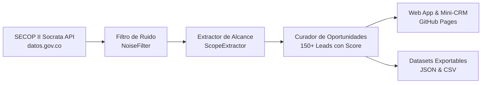

# SECOP II Opportunities Engine & Lead Observatory ⚡🇨🇴

> Motor inteligente para la consulta, filtrado de ruido y enriquecimiento de contratación pública colombiana (SECOP II) enfocado en **Licitantes Directos** (Observatorio de Oportunidades para aliados y consultores) y **Proveedores B2B** (Generador de Leads calificados para venta de insumos, acero, maquinaria gastronómica y energía solar).

[](https://github.com/andres-solanor/secop-opportunities-engine/actions)
[](https://andres-solanor.github.io/secop-opportunities-engine/)

---

## 🎯 ¿Por qué existe este proyecto? (El Problema Resuelto)

En Colombia, el **~75-80% de los procesos en SECOP II son contratos de prestación de servicios individuales (OPS)** o contrataciones directas sin demanda comercial de suministros. Además:
1. Las empresas y proveedores pierden horas intentando encontrar procesos entre descripciones vagas.
2. Los pliegos técnicos y anexos sepultan la información crítica de cantidades y materiales requeridos.
3. Los proveedores de insumos (acero, maquinaria para cocina, energía solar) no se enteran a tiempo de quién ganó las obras públicas para ofrecerles sus suministros de inmediato.

### La Solución de Doble Vía:
* **Persona A (Aliados Consultores / Bufetes de Abogados):** Un *Observatorio de Oportunidades* que detecta licitaciones abiertas y borradores de pliegos con tiempo para estructurar ofertas de consorcio o presentar observaciones.
* **Persona B (Proveedores Industriales B2B):**
  * **Etapa 1 (Pre-Licitación):** Oportunidades para compartir con clientes contratistas ("Lícita en esta obra y nosotros te suministramos el material").
  * **Etapa 2 (Adjudicados):** Leads de prospección comercial directa al contratista/consorcio ganador con valor, NIT y propuesta de contacto generada automáticamente.

---

## 🚀 Sectores Especializados en el MVP

| Sector | Insumos & Materiales Detectados | Público Objetivo |
|---|---|---|
| 🏗️ **Acero & Metalmecánica** | Estructuras metálicas, perfiles, vigas, tubería estructural, varilla, cerchas, cubiertas. | Acerías, distribuidores de perfiles, talleres de soldadura e ingeniería estructural. |
| 🍳 **HORECA & Gastronomía** | Cocinas industriales, hornos combinados, cuartos fríos, refrigeración, marmitas, dotación PAE. | Fabricantes y distribuidores de equipamiento institucional, frío comercial y catering. |
| ☀️ **Energía Solar & Alumbrado** | Paneles solares, inversores fotovoltaicos, luminarias LED, transformadores, subestaciones eléctricas. | Empresas de ingeniería eléctrica, EPC solares y distribuidores de iluminación pública. |
| 🏛️ **Obra Civil & Licitaciones** | Infraestructura vial, puentes, sedes educativas, hospitales, adecuación institucional. | Contratistas generales, consorcios y aliados de estructuración de licitaciones. |

---

## 🛠️ Arquitectura Técnica



* **Backend / Extracción:** Python (100% biblioteca estándar, sin dependencias pesadas).
* **Filtros Anti-Ruido:** Exclusión algorítmica de OPS, umbral de presupuesto mínimo ($50M+ COP) y descarte de procesos cancelados/desiertos.
* **Frontend Web:** HTML5 Semántico, CSS3 moderno (Dark Obsidian Glassmorphism) y Javascript vanilla responsivo con persistencia local (`localStorage`) para seguimiento comercial.
* **Automatización Serverless:** GitHub Actions ejecuta un cron diario a las 6:00 AM (hora Colombia) para actualizar el dataset automáticamente en GitHub Pages sin costo de servidor.

---

## 💻 Ejecución Local

1. Clonar el repositorio:
```bash
git clone https://github.com/andres-solanor/secop-opportunities-engine.git
cd secop-opportunities-engine
```

2. Ejecutar pruebas unitarias:
```bash
python -m unittest discover tests
```

3. Actualizar datos en vivo desde SECOP II:
```bash
python -m src.export_prospects
```

4. Abrir la interfaz web:
```bash
# Iniciar servidor local
python -m http.server 8000 --directory web
# Abrir en navegador: http://localhost:8000
```

---

## 📈 Roadmap & Próximos Pasos

- [x] Ingesta de datos desde API abierta de SECOP II (`p6dx-8zbt` y `jbjy-vk9h`).
- [x] Filtro de ruido anti-OPS y umbral presupuestal.
- [x] Taxonomías de Acero, HORECA y Energía Solar.
- [x] Tablero Web con Mini-CRM y generador de mensajes de contacto para WhatsApp/Email.
- [x] Despliegue en GitHub Pages con actualización diaria automatizada vía GitHub Actions.
- [ ] Enriquecimiento automático de teléfonos y correos de contratistas cruzando con RUES.
- [ ] Análisis de PDFs de pliegos y cantidades de obra con LLM.
- [ ] Alertas automáticas por correo electrónico o WhatsApp diario.

---

Desarrollado con foco en generación de valor real para contratación pública colombiana.
