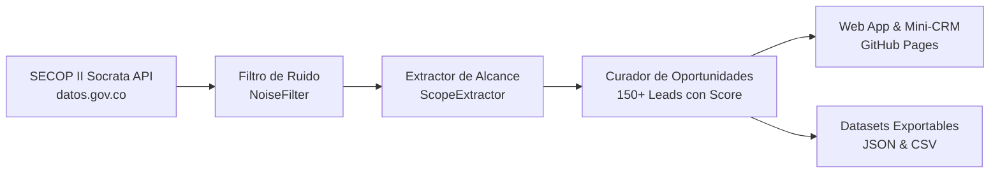

# SECOP II Opportunities Engine & Lead Observatory ⚡🇨🇴

> Motor inteligente para la consulta, filtrado de ruido y enriquecimiento de contratación pública colombiana (SECOP II) enfocado en **Licitantes Directos** (Observatorio de Oportunidades para aliados y consultores) y **Proveedores B2B** (Generador de Leads calificados para venta de insumos, acero, maquinaria gastronómica y energía solar).

[](https://github.com/andres-solanor/secop-opportunities-engine/actions)
[](https://andres-solanor.github.io/secop-opportunities-engine/)

---

## 🎯 ¿Por qué existe este proyecto? (El Problema Resuelto)

En SECOP II, una parte grande de lo que se publica son **contratos de prestación de servicios** o contrataciones directas sin demanda comercial de suministros: entre el 16 y el 30 de septiembre de 2026, 1.969 de los 5.744 procesos publicados de $50 millones o más eran de prestación de servicios (conteo del pipeline; ver [`docs/DESCUBRIMIENTO_SECTORES_2026-09-30.md`](docs/DESCUBRIMIENTO_SECTORES_2026-09-30.md)). Además:
1. Las empresas y proveedores pierden horas intentando encontrar procesos entre descripciones vagas.
2. Los pliegos técnicos y anexos sepultan la información crítica de cantidades y materiales requeridos.
3. Los proveedores de insumos (acero, maquinaria para cocina, energía solar) no se enteran a tiempo de quién ganó las obras públicas para ofrecerles sus suministros de inmediato.

### La Solución de Doble Vía:
* **Persona A (Aliados Consultores / Bufetes de Abogados):** Un *Observatorio de Oportunidades* que detecta licitaciones abiertas y borradores de pliegos con tiempo para estructurar ofertas de consorcio o presentar observaciones.
* **Persona B (Proveedores Industriales B2B):**
  * **Etapa 1 (Pre-Licitación):** Oportunidades para compartir con clientes contratistas ("Lícita en esta obra y nosotros te suministramos el material").
  * **Etapa 2 (Adjudicados):** Leads de prospección comercial directa al contratista/consorcio ganador con valor, NIT y propuesta de contacto generada automáticamente.

---

## 🚀 Sectores Especializados en el MVP

| Sector | Insumos & Materiales Detectados | Público Objetivo |
|---|---|---|
| 🏗️ **Acero & Metalmecánica** | Estructuras metálicas, perfiles, vigas, tubería estructural, varilla, cerchas, cubiertas. | Acerías, distribuidores de perfiles, talleres de soldadura e ingeniería estructural. |
| 🍳 **HORECA & Gastronomía** | Cocinas industriales, hornos combinados, cuartos fríos, refrigeración, marmitas, dotación PAE. | Fabricantes y distribuidores de equipamiento institucional, frío comercial y catering. |
| ☀️ **Energía Solar & Alumbrado** | Paneles solares, inversores fotovoltaicos, luminarias LED, transformadores, subestaciones eléctricas. | Empresas de ingeniería eléctrica, EPC solares y distribuidores de iluminación pública. |
| 🏛️ **Obra Civil & Licitaciones** | Infraestructura vial, puentes, sedes educativas, hospitales, adecuación institucional. | Contratistas generales, consorcios y aliados de estructuración de licitaciones. |

---

## 🛠️ Arquitectura Técnica


```mermaid
flowchart LR
    A[SECOP II Socrata API<br/>datos.gov.co] --> B[Filtro de Ruido<br/>NoiseFilter]
    B --> C[Extractor de Alcance<br/>ScopeExtractor]
    C --> D[Curador de Oportunidades<br/>150+ Leads con Score]
    D --> E[Web App & Mini-CRM<br/>GitHub Pages]
    D --> F[Datasets Exportables<br/>JSON & CSV]
```

* **Backend / Extracción:** Python (100% biblioteca estándar, sin dependencias pesadas).
* **Filtros Anti-Ruido:** Exclusión algorítmica de OPS, umbral de presupuesto mínimo ($50M+ COP) y descarte de procesos cancelados/desiertos.
* **Frontend Web:** HTML5 Semántico, CSS3 moderno (Dark Obsidian Glassmorphism) y Javascript vanilla responsivo con persistencia local (`localStorage`) para seguimiento comercial.
* **Automatización Serverless:** GitHub Actions ejecuta un cron diario a las 6:00 AM (hora Colombia) para actualizar el dataset automáticamente en GitHub Pages sin costo de servidor.
* **Sectores como configuración:** los sectores, sus palabras clave y lo que se le pide a SECOP II viven en [`config/taxonomy.json`](config/taxonomy.json). Agregar un sector es editar ese archivo.
* **Nada se pierde de vista:** cada proceso descargado queda contado (duplicado, rechazado con su motivo, sin clasificar o clasificado). Lo que pasa el filtro pero no entra al tablero se puede revisar en la vista **🔎 Fuera del tablero** (oculta por defecto) y en el reporte `data/hidden_summary.md`, que agrupa lo sin clasificar para decidir sectores nuevos.
* **Contrato de datos:** el pipeline valida el dataset antes de publicarlo (`src/schema.py`); si algo no cumple, la corrida falla y la web conserva los datos del día anterior.

---

## 👤 Cuentas con Google y Perfil de Oportunidades

El valor llega **antes** del registro. Cualquier visitante responde 4 preguntas (rol, oferta, necesidades/conexiones, cobertura y tamaño) y mientras escribe ve en vivo cuántos procesos de SECOP II coinciden con su perfil. Al terminar recibe su **Perfil de Oportunidades**:

* Propuesta de valor clarificada y pitch de 30 segundos listo para copiar.
* Mercado direccionable en pesos, procesos abiertos y entidades compradoras en su zona.
* Cliente ideal y las conexiones que busca (contratistas ganadores, entidades, aliados para consorcio, proveedores complementarios) con cifras reales.
* Recomendaciones según lo que necesita (consorcio, experiencia RUP, capital, pólizas…).
* Fuerza del perfil y qué completar para mejorarla.

Los nombres de empresas y las oportunidades concretas se desbloquean al **guardar el perfil con Google**. Con la cuenta activa aparece la pestaña **✨ Para Ti** (oportunidades ordenadas por afinidad, con el porqué de cada una) y los pitches se firman con los datos de la empresa.

| Archivo | Rol |
|---|---|
| `web/profile-engine.js` | Motor puro (sin DOM): detección de sector, análisis del perfil y puntaje de afinidad. Probado con `node --test tests/profile_engine.test.js`. |
| `web/profile.js` | Onboarding, vista de perfil, banner y menú de cuenta. |
| `web/auth.js` | Google Identity Services ("Sign in with Google"). |
| `web/taxonomy.js` | Generado por el pipeline desde `config/taxonomy.json` (mismo vocabulario que Python). |
| `web/config.js` | `GOOGLE_CLIENT_ID` público. |

### Configurar Google OAuth
1. En [Google Cloud Console](https://console.cloud.google.com/apis/credentials) crea un **ID de cliente OAuth 2.0** de tipo *Aplicación web*.
2. En **Orígenes de JavaScript autorizados** agrega `https://andres-solanor.github.io` y `http://localhost:8000`.
3. Configura la pantalla de consentimiento (alcances básicos: `openid`, `email`, `profile`).
4. Pega el ID en `web/config.js` → `GOOGLE_CLIENT_ID`.

Sin ID configurado, el botón funciona en **modo demo local** para poder probar el flujo completo.

> ⚠️ **Limitación actual:** el sitio es estático, así que perfiles y sesión viven en `localStorage` del navegador y el token de Google se decodifica pero no se verifica en un servidor. Es suficiente para validar la activación; para perfiles multi-dispositivo, conexiones entre usuarios y alertas se necesita un backend (p. ej. Supabase/Firebase) que verifique el `credential` de Google.

---

## 💻 Ejecución Local

1. Clonar el repositorio:
```bash
git clone https://github.com/andres-solanor/secop-opportunities-engine.git
cd secop-opportunities-engine
```

2. Ejecutar las verificaciones (las mismas que corre CI en cada pull request):
```bash
python -m pip install ruff && ruff check .   # lint de Python
python -m unittest discover tests            # pruebas de Python
npm ci                                       # herramientas de desarrollo (solo la primera vez)
npm run lint                                 # lint de JavaScript
npm test                                     # pruebas de los motores de JavaScript
npx playwright install chromium              # navegador de pruebas (solo la primera vez)
npm run test:e2e                             # pruebas de humo en un navegador real
```

3. Actualizar datos en vivo desde SECOP II:
```bash
python -m src.export_prospects               # escribe en data/ y web/
python -m src.export_prospects --out out     # corrida de prueba: escribe en out/ sin tocar el repositorio
```
Opcional: define `SOCRATA_APP_TOKEN` para un límite de peticiones más alto en datos.gov.co.

4. Abrir la interfaz web:
```bash
# Iniciar servidor local
python -m http.server 8000 --directory web
# Abrir en navegador: http://localhost:8000
```

---

## 📈 Roadmap & Próximos Pasos

- [x] Ingesta de datos desde API abierta de SECOP II (`p6dx-8zbt` y `jbjy-vk9h`).
- [x] Filtro de ruido anti-OPS y umbral presupuestal.
- [x] Taxonomías de Acero, HORECA y Energía Solar.
- [x] Tablero Web con Mini-CRM y generador de mensajes de contacto para WhatsApp/Email.
- [x] Despliegue en GitHub Pages con actualización diaria automatizada vía GitHub Actions.
- [x] Cuentas con Google y Perfil de Oportunidades con afinidad por oportunidad.
- [ ] Backend de perfiles (verificación del token de Google, sincronización multi-dispositivo y conexiones entre perfiles).
- [ ] Enriquecimiento automático de teléfonos y correos de contratistas cruzando con RUES.
- [ ] Análisis de PDFs de pliegos y cantidades de obra con LLM.
- [ ] Alertas automáticas por correo electrónico o WhatsApp diario.

---

Desarrollado con foco en generación de valor real para contratación pública colombiana.
