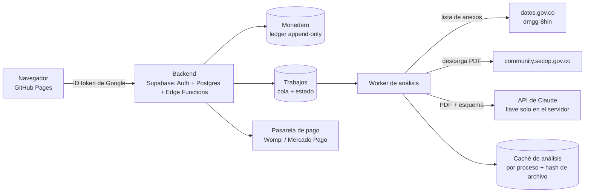

# Diseño: monedero de créditos IA y funciones bajo demanda

> **Para quién es este documento.** Para el dueño del producto y el revisor de diseño (decisiones de negocio en §9) y para el agente que implemente las fases. Contexto general en [`HANDOFF.md`](./HANDOFF.md).

**Estado:** diseño. Nada de esto está implementado. Requiere un backend: el sitio actual es estático (GitHub Pages) y no puede guardar saldos, cobrar ni ocultar llaves de API.

---

## 1. Resumen

Las funciones **caras** (análisis con IA de los anexos de un contrato, perfil profesional enriquecido, dossiers de competidores y aliados) se ejecutan **bajo demanda** y se pagan con **créditos** de un monedero asociado a la cuenta de Google. Lo que es barato y sirve a todos (descarga diaria de SECOP, cruce con contratos, badges) sigue **gratis y automático**.

Los créditos también sirven al objetivo de activación: **créditos de bienvenida al crear la cuenta**, para que el primer análisis con IA sea el incentivo "duro" que hoy le falta al registro (ver `DISENO_PERFILES.md` §8).

---

## 2. Qué es gratis y qué es bajo demanda

Criterio: una función es **bajo demanda** si su costo depende de cada usuario y cada proceso (LLM, fuentes pagas, descargas pesadas). Es **gratis en lote** si se calcula una vez al día para todos.

| Función | Costo real | Modo | Por qué |
|---|---|---|---|
| Descarga diaria de SECOP, filtros, sectores y fechas | Solo tiempo de GitHub Actions | Gratis, en lote | Ya existe; sirve a todos |
| Cruce con SECOP II Contratos (fechas, representante legal, trayectoria, entidad) | Consultas a datos abiertos | Gratis, en lote | Ya existe; se hace una vez al día para ~150 procesos |
| Conteo de competidores por proceso (ofertas recibidas) | Consultas a datos abiertos | Gratis, en lote (propuesto) | Barato y muy valioso para la ficha (§6) |
| **Análisis de anexos con IA** (requisitos, cantidades, garantías, criterios) | LLM sobre PDFs de 20 a 200+ páginas + descarga | **Créditos** | Es lo más caro y varía por proceso |
| **Encaje perfil ↔ contrato** ("qué te piden y qué te falta") | LLM pequeño sobre el análisis ya hecho | **Créditos** (bajo) | Depende de cada perfil |
| **Perfil profesional enriquecido** (skills) | LLM + lectura del sitio web + historial SECOP del NIT | **Créditos** | Se hace pocas veces por cuenta |
| **Dossier de aliado o competidor** (historial, consorcios, sanciones, ofertas) | Varias consultas + LLM para redactar | **Créditos** (bajo) | Bajo demanda sobre un NIT concreto |
| Fuentes pagas (proveedor de datos RUES u otro) | Costo por consulta del proveedor | **Créditos** | Costo externo directo |

---

## 3. El monedero de créditos

### 3.1 Reglas

- **1 crédito = una unidad fija de valor interno.** Se propone que valga lo suficiente para que un análisis típico cueste un número pequeño y fácil de entender (ver §3.2).
- **Cotizar antes de ejecutar.** Cada acción muestra su costo ("Analizar anexos · 5 créditos") y el saldo resultante. Nada se cobra sin confirmación.
- **Reservar → ejecutar → confirmar o reembolsar.** Al iniciar se **reservan** los créditos; si el trabajo falla (PDF ilegible, descarga bloqueada, error del modelo) se **reembolsan** automáticamente.
- **Resultados compartidos en caché.** El análisis de los anexos de un proceso es igual para todos. El primero que lo pide paga el análisis completo; los siguientes pagan solo el **encaje con su perfil**, que es mucho más barato. Eso baja el costo real y permite un precio menor.
- **Créditos de bienvenida:** una cantidad fija al crear la cuenta con Google, que alcanza para 1 o 2 análisis completos.
- **Recargas y plan mensual:** paquetes de créditos y, más adelante, un plan con créditos mensuales incluidos.
- **Anti-abuso:** una sola bonificación por cuenta de Google verificada, límites diarios por cuenta y registro de cada transacción.

### 3.2 Estimación de costos (modelos Claude, precios de lista a 2026)

| Modelo | Entrada (US$/millón de tokens) | Salida (US$/millón de tokens) |
|---|---|---|
| Claude Opus 5 | 5,00 | 25,00 |
| Claude Sonnet 5 | 2,00 | 10,00 |
| Claude Haiku 4.5 | 1,00 | 5,00 |

- La API por lotes (asíncrona) cuesta aproximadamente la mitad.
- Límite por PDF: 32 MB por solicitud y 600 páginas.
- **Supuesto por medir:** ~2.000 tokens por página de PDF (texto más imagen de la página). Debe medirse con documentos reales usando el conteo de tokens de la API antes de fijar precios.

| Acción | Entrada estimada | Salida estimada | Costo con Opus 5 | Costo con Sonnet 5 |
|---|---|---|---|---|
| Análisis de anexos (60 páginas relevantes) | ~120.000 tokens | ~5.000 tokens | ~US$0,73 | ~US$0,29 |
| Análisis de anexos (200 páginas) | ~400.000 tokens | ~8.000 tokens | ~US$2,20 | ~US$0,88 |
| Encaje perfil ↔ contrato (sobre el análisis en caché) | ~10.000 tokens | ~2.000 tokens | ~US$0,10 | ~US$0,04 |
| Perfil profesional enriquecido | ~20.000 tokens | ~4.000 tokens | ~US$0,20 | ~US$0,08 |

**Precio sugerido:** costo real × 3 o 4 de margen, para cubrir infraestructura, reintentos y los análisis que fallan y se reembolsan. Ejemplo de tabla inicial, a validar: análisis de anexos 5 créditos, encaje 1 crédito, perfil enriquecido 2 créditos, dossier 1 crédito.

**Elección del modelo.** La recomendación por defecto es Claude Opus 5 para la extracción (máxima precisión en requisitos habilitantes, donde un error cuesta una licitación). Sonnet 5 conviene si las pruebas con documentos reales muestran la misma calidad. Es una decisión del dueño (§9), tomada con una evaluación sobre 10 a 20 pliegos reales. El backend se diseña con una interfaz de proveedor para poder cambiar de modelo o de proveedor (por ejemplo DeepSeek, que se mencionó) sin tocar el resto.

---

## 4. Arquitectura propuesta

- **Autenticación.** Se reutiliza el login con Google actual. El ID token se envía al backend, que lo verifica (esto cierra la limitación de hoy: el token no se verifica). Supabase permite iniciar sesión con un ID token de Google.
- **Base de datos (Postgres):**
  - `wallets(user_id, saldo)`;
  - `credit_transactions(id, user_id, tipo[bono|recarga|reserva|cobro|reembolso], creditos, trabajo_id, idempotency_key, creado)`, append-only; el saldo se deriva del ledger;
  - `jobs(id, user_id, tipo, proceso_id, estado, costo_cotizado, resultado_id)`;
  - `analysis_cache(proceso_id, documentos_hash, modelo, version_esquema, resultado_json)`;
  - `profiles` (migración del perfil que hoy vive en `localStorage`).
- **Pagos.** Se necesita una pasarela local para Colombia (PSE, tarjetas, Nequi). Opciones a evaluar: Wompi o Mercado Pago. Hay que validar requisitos, comisiones y facturación electrónica.
- **Seguridad.** La llave del LLM vive solo en el servidor. Cada cobro usa una `idempotency_key` para no cobrar dos veces. La tabla de saldos no se puede escribir desde el navegador.
- **El sitio estático sigue igual** para todo lo gratis. El backend solo atiende cuenta, monedero, trabajos bajo demanda y datos privados.

---

## 5. Función 1: análisis de anexos y encaje con el perfil

### 5.1 Fuente verificada

El diagnóstico de fuentes (workflow "Probe SECOP sources", run `36371425168`, 28-sep-2026) confirmó:
- **"SECOP II - Archivos Descarga Desde 2025"** (`dmgg-8hin`) lista los archivos de cada proceso.
- La **llave** es `proceso` = `id_del_portafolio`, la misma que ya usamos para cruzar contratos.
- Campos: `nombre_archivo`, `extensi_n`, `tamanno_archivo`, `fecha_carga`, `url_descarga_documento`, `n_mero_de_contrato`.
- Ejemplo real: el proceso PAE de Córdoba (`CO1.BDOS.10160344`) tiene **50 o más archivos**: estudios previos (5,4 MB), aviso de convocatoria, formatos de experiencia y de capacidad financiera, conformación de proponente plural, actas parciales y un archivo de **51 MB**.

**Riesgos por validar antes de construir:**
- Que `url_descarga_documento` descargue sin sesión ni captcha y con qué límites de frecuencia.
- Archivos de más de 32 MB: se dividen, se procesan por partes o se omiten con aviso.
- Anexos escaneados sin texto: se leen como imagen, lo que cuesta más tokens.

### 5.2 Flujo

1. **Listar** los archivos del proceso (gratis, datos abiertos).
2. **Seleccionar** los relevantes por nombre y tipo: pliego o estudios previos, anexo técnico, presupuesto o cantidades, formatos de experiencia y capacidad, matriz de riesgos. Se descartan actas, garantías ya expedidas y documentos de ejecución.
3. **Cotizar** al usuario según las páginas y el tamaño estimados.
4. **Descargar y extraer** con el LLM, usando salida estructurada (esquema fijo) y citas por página.
5. **Guardar en caché** por proceso y hash de los archivos.
6. **Encaje con el perfil:** una llamada pequeña cruza el análisis con el perfil y responde qué te piden, qué cumples y qué te falta.

### 5.3 Qué se extrae (esquema)

| Bloque | Campos |
|---|---|
| Objeto y alcance | Objeto, lugar de ejecución, plazo, forma de pago, anticipo |
| **Necesidades concretas** | Ítems con unidad, cantidad y valor unitario o total (acero, cocinas, luminarias…) |
| **Requisitos habilitantes** | Experiencia (número de contratos, valor mínimo, códigos UNSPSC), capacidad financiera (liquidez, endeudamiento, cobertura de intereses), capacidad organizacional, K de contratación si aplica |
| Garantías | Seriedad, cumplimiento y otras, con porcentaje y vigencia |
| Evaluación | Criterios y puntajes, factores de desempate, incentivos (mipyme, discapacidad, industria nacional) |
| Cronograma | Observaciones, cierre, evaluación, adjudicación |
| Riesgos | Riesgos que asigna el contratista y cláusulas sensibles |
| Evidencia | Documento y página de cada dato (citas) |

**Encaje con el perfil**, que se muestra en la ficha y en el detalle:
- ✅ Lo que cumples, con evidencia de tu perfil o de tu historial en SECOP.
- ⚠️ Lo que te falta y cómo cubrirlo; por ejemplo, "Experiencia: piden 2 contratos por más de $1.500M en el código 72141000; tienes 1 → busca un aliado para consorcio".
- 🧩 Aliados sugeridos: empresas con esa experiencia, tomadas de contratos, ofertas y grupos de proveedores.
- 📦 Para proveedores: la lista de insumos y cantidades que el contratista va a comprar.

---

## 6. Función 2: cruce con múltiples fuentes (competencia, aliados y riesgo)

Datasets confirmados en el diagnóstico:

| Dataset | ID | Qué aporta | Llave | Modo propuesto |
|---|---|---|---|---|
| Ofertas por proceso | `wi7w-2nvm` (histórico `b28v-edj8`) | Quién ofertó y por cuánto: competencia real | `id_del_proceso_de_compra` = `id_portafolio` | **Gratis en lote:** "N ofertas" en la ficha. **Créditos:** el dossier de cada competidor |
| Grupos de proveedores | `ceth-n4bn` | **Integrantes de consorcios y UT**, % de participación y líder | Nombre o código del grupo, NIT del participante | Créditos (dossier); resuelve el "1 contrato" de los consorcios |
| Plan Anual de Adquisiciones (SECOP II) | `9sue-ezhx` | Compras planeadas: fecha esperada, valor, UNSPSC y contacto de la entidad | NIT de la entidad + UNSPSC | Gratis en lote (alertas tempranas); el contacto solo con cuenta |
| Multas y sanciones SECOP I | `4n4q-k399` | Sanciones a contratistas | NIT del contratista | Gratis en lote como badge de riesgo (validar cobertura; es SECOP I) |

**Privacidad.** `ceth-n4bn` y `9sue-ezhx` traen **teléfonos y correos de personas** (representante legal del grupo, responsables en la entidad). Esos datos **no se publican en el sitio estático**: solo se muestran a usuarios con cuenta, desde el backend, con la nota legal y la finalidad comercial (ver `PROPUESTA_FICHAS.md` §5.3).

---

## 7. Función 3: perfil profesional enriquecido con skills

**Qué es una skill:** un paquete versionado de instrucciones, esquema de salida y ejemplos para una tarea concreta. Se guarda en el repositorio y se evalúa con casos reales. Propuestas:

| Skill | Entradas | Salida |
|---|---|---|
| `perfil-empresa` | Respuestas del onboarding, sitio web, historial SECOP del NIT (contratos `jbjy-vk9h`, ofertas `wi7w-2nvm`, consorcios `ceth-n4bn`) | Propuesta de valor profesional, capacidades con **evidencia** (contratos reales), sectores y códigos UNSPSC sugeridos, diferenciales |
| `experiencia-rup` | Contratos ejecutados del NIT | Experiencia acreditable agrupada por código UNSPSC y valor: la base del encaje de la función 1 |
| `pitch-oportunidad` | Perfil + análisis de un proceso | Mensaje de contacto específico para ese contrato (no plantilla) |

**Reglas:**
- El usuario **revisa y aprueba** cada cambio antes de que se guarde en su perfil.
- Todo dato afirmado debe tener evidencia (enlace a un contrato de SECOP o a su sitio web).
- Sin evidencia, la skill lo marca como "por confirmar"; no lo inventa.

---

## 8. Plan por fases

| Fase | Contenido | Depende de |
|---|---|---|
| A. Backend mínimo | Supabase: verificación del token de Google, perfiles en base de datos, migración desde `localStorage` | Decisión 1 |
| B. Monedero sin pagos | Ledger, créditos de bienvenida, reserva y reembolso, cotización en la UI | A |
| C. Análisis de anexos (piloto) | Validar la descarga de anexos; evaluación con 10–20 pliegos reales (precisión y costo por página); caché compartida | B, decisiones 2 y 3 |
| D. Encaje perfil ↔ contrato + skill `experiencia-rup` | Ficha con "qué te piden y qué te falta" | C |
| E. Pagos | Pasarela, paquetes de recarga y facturación | B, decisión 4 |
| F. Dossiers y fuentes adicionales | Ofertas, consorcios, PAA, sanciones; contactos solo con cuenta | A |

Lo gratis de §6 (conteo de ofertas, sanciones y PAA en lote) **no depende del backend** y se puede agregar ya al pipeline actual.

---

## 9. Decisiones del dueño

1. **Backend:** ¿Supabase (recomendado: auth con Google, Postgres y funciones en un solo servicio) o Firebase?
2. **Modelo de IA:** ¿Claude Opus 5 (precisión) o Sonnet 5 (costo), decidido con la evaluación de la fase C? ¿Se mantiene la opción de DeepSeek? Ojo: no hay ninguna llave de API configurada hoy.
3. **Precio del crédito y créditos de bienvenida:** valor en COP de un crédito y cuántos se regalan al registrarse.
4. **Pasarela de pagos:** Wompi, Mercado Pago u otra.
5. **Contactos personales** (teléfonos y correos de `ceth-n4bn` y `9sue-ezhx`): ¿se muestran con cuenta, con créditos o nunca? Recomendación: revisarlo con asesoría legal.
6. **¿Agrego ya al pipeline lo gratis de §6** (conteo de ofertas por proceso, integrantes de consorcios, sanciones y PAA como alertas tempranas), mientras se decide lo demás?
