# Diseño: Cuentas con Google y Perfil de Oportunidades

> **Para quién es este documento.** Para la persona que revisa el diseño (*human in the loop*) y para cualquier agente que continúe el trabajo. Explica qué se construyó, por qué se construyó así, qué alternativas se descartaron y qué queda por decidir.
> El estado operativo y el backlog están en [`HANDOFF.md`](./HANDOFF.md). Las convenciones del código están en [`../CLAUDE.md`](../CLAUDE.md).

**Estado:** implementado y probado en la rama `claude/gmail-oauth-account-creation-t7o73y`, sin PR. El login real con Google está pendiente de que se configure el ID de cliente OAuth; mientras tanto funciona un modo demo local.

---

## 1. Resumen

Se agregó a la web de SECOP Engine un sistema para que las empresas **construyan un perfil completo** (qué ofrecen, qué necesitan, a quién buscan, dónde operan y de qué tamaño son) y lo **guarden con su cuenta de Google**.

La apuesta de diseño es que el valor llegue **antes** del registro. En unos 2 minutos, y sin crear cuenta, la empresa recibe un *Perfil de Oportunidades* calculado con datos reales de SECOP II. Incluye su propuesta de valor, el tamaño de su mercado en pesos, su cliente ideal, las conexiones que busca con cifras concretas, recomendaciones según lo que necesita y un pitch listo para usar. Los nombres de las empresas y entidades se muestran difuminados, y guardar con Google los desbloquea. A partir de ahí, la pestaña **✨ Para Ti** ordena todas las oportunidades por afinidad con el perfil y explica por qué encaja cada una.

---

## 2. Problema y objetivo

**Problema.** El tablero ya filtra y clasifica oportunidades, pero trata igual a todos los visitantes. Sin saber quién es la empresa no hay forma de:
- priorizar las oportunidades que le sirven;
- conectarla con otras empresas (el objetivo final del producto);
- darle un motivo para crear cuenta y volver.

**Objetivo del dueño del producto** (en sus palabras): *"crear los perfiles completos que se necesitan para conectar oportunidades con los perfiles… que el momento wow se sienta incluso antes de generar conexiones con las oportunidades externas (clarificación de lo que ofrece, necesita, lo que busca, las conexiones que está buscando)… suficiente valor como para incentivar a crear su cuenta y activarse."*

**Criterio de éxito del diseño.** Que alguien que llega sin intención de registrarse termine el onboarding. Que al ver su perfil sienta que *entendimos su negocio y le mostramos un mercado que no veía*. Y que guarde el perfil con Google.

---

## 3. Principios de diseño

1. **Valor antes que formulario.** No se pide cuenta para empezar. El registro aparece cuando el usuario ya vio algo suyo que quiere conservar.
2. **Recompensa en cada paso.** Una barra en vivo ("26 procesos por $57,7 mil millones ya coinciden con tu perfil") se actualiza con cada respuesta. Cada dato que el usuario entrega le devuelve algo en el momento.
3. **Hablar en lenguaje de negocio, no de datos.** Se habla de "Mercado direccionable", "cliente ideal" y "llegas a tiempo", no de "registros filtrados".
4. **Todo número es real.** Cada cifra se calcula con el dataset curado de SECOP II que ya publica el pipeline. No hay textos de relleno con cifras inventadas.
5. **Explicar el porqué.** Cada oportunidad en "Para Ti" muestra sus razones: "Sector: Acero", "En tu zona: Antioquia", "Dentro de tu ticket".
6. **Consistencia con lo existente.** Se mantiene el estilo visual oscuro con vidrio translúcido, JavaScript sin frameworks ni build y Python solo con la biblioteca estándar.

---

## 4. Recorrido del usuario

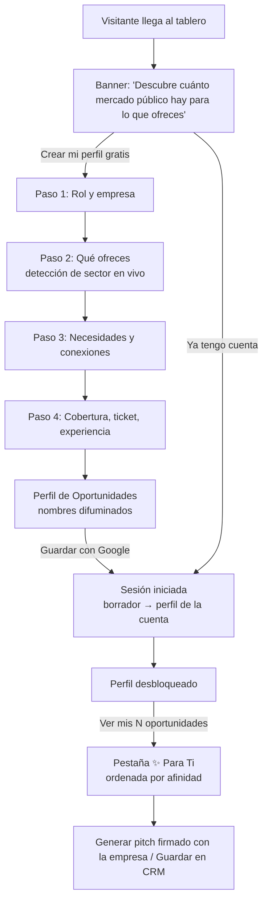

### 4.1 Entrada: el banner

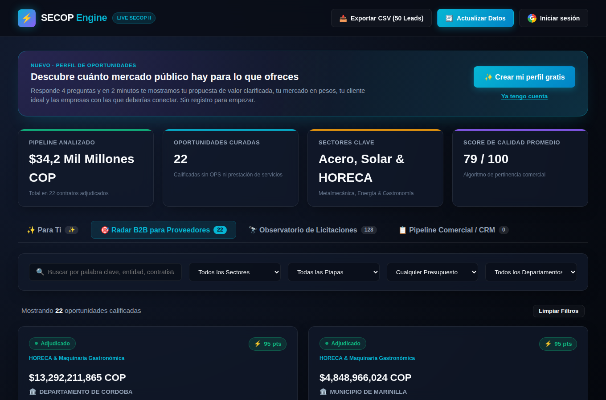

Se agregó un banner sobre los KPIs. Para un visitante sin perfil, promete un resultado concreto ("tu propuesta de valor clarificada, tu mercado en pesos, tu cliente ideal y las empresas con las que deberías conectar"). También aclara que **no pide registro para empezar**. "Ya tengo cuenta" es un enlace secundario.

La pestaña "✨ Para Ti" aparece desde el inicio, con un ✨ en lugar del contador. Al abrirla sin perfil muestra una invitación a crearlo.

Cuando ya existe un perfil, el banner resume el resultado del usuario: fuerza del perfil, número de oportunidades afines, tamaño del mercado y propuesta de valor.

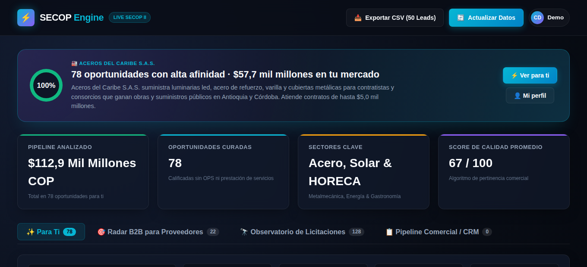

### 4.2 Onboarding de 4 pasos

| Paso | Qué se pregunta | Por qué | Para avanzar |
|---|---|---|---|
| 1. ¿Quién eres? | Rol (Proveedor, Contratista o Consultor), nombre, NIT y sitio web | El rol cambia qué etapas de contratación le sirven y cómo se redacta su propuesta | Elegir un rol |
| 2. ¿Qué ofreces? | Texto libre y sugerencias por sector | El texto libre captura su forma de describirse; las sugerencias ayudan a quien no sabe cómo describirse | Que se detecte al menos un sector |
| 3. ¿Qué necesitas y a quién buscas? | 8 necesidades y 5 tipos de conexión (selección múltiple) | Es la "clarificación" que pidió el dueño; alimenta las recomendaciones y las conexiones | Opcional |
| 4. ¿Dónde y de qué tamaño? | Departamentos o "Todo el país", rango de contratos, años de experiencia, RUP | Ajusta el mercado a su capacidad real | Opcional |

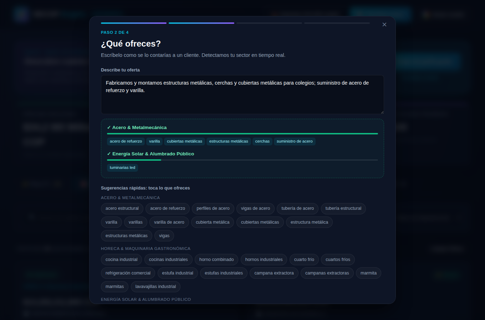

**El paso 2 es el primer momento wow.** Mientras la persona escribe, aparece "✓ Acero & Metalmecánica" con una barra de intensidad y las palabras que reconocimos. La detección usa el **mismo vocabulario** que el pipeline de Python con el que se clasifican las oportunidades (`web/taxonomy.js` se genera desde `ScopeExtractor.TAXONOMIES`). Por eso lo que se detecta en el perfil es exactamente lo que después se usa para encontrar coincidencias.

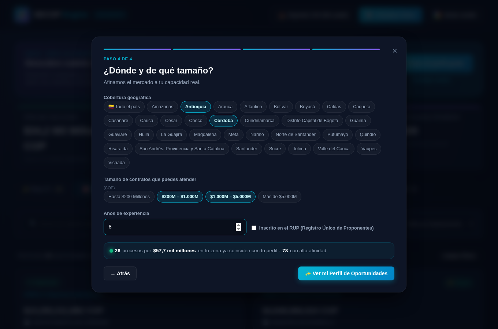

**La barra en vivo** al pie de cada paso muestra cuántos procesos y cuántos pesos coinciden hasta ese momento. Al restringir la zona, el número baja pero se vuelve más relevante. El usuario ve el efecto de cada respuesta.

La versión móvil apila los elementos en una sola columna:

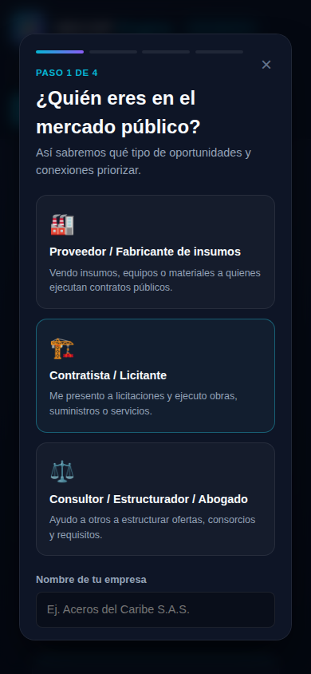

### 4.3 El Perfil de Oportunidades (momento wow principal)

| Sin cuenta (bloqueado) | Con cuenta (desbloqueado) |
|---|---|
| 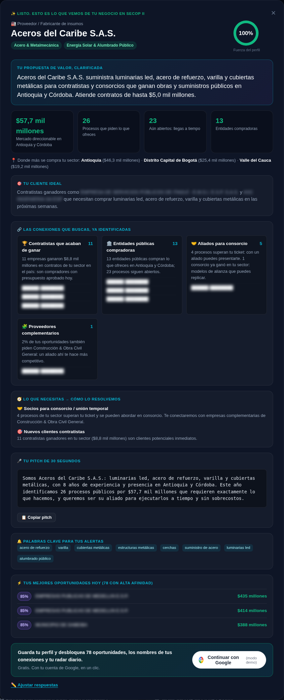 | 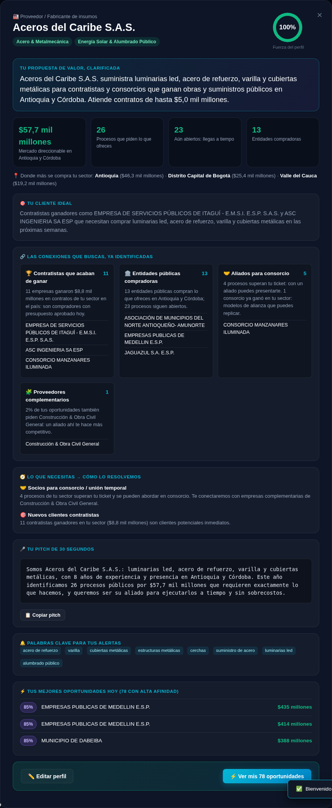 |

Bloques, en orden de lectura:

| Bloque | Qué muestra | De dónde sale |
|---|---|---|
| Encabezado | Rol, empresa, sectores detectados, anillo de "Fuerza del perfil" | Respuestas y detección de sector |
| **Tu propuesta de valor, clarificada** | "*Aceros del Caribe S.A.S. suministra acero de refuerzo, varilla y cubiertas metálicas para contratistas y consorcios que ganan obras y suministros públicos en Antioquia y Córdoba. Atiende contratos de hasta $5,0 mil millones.*" | Plantilla por rol + primeras 4 capacidades + zona + ticket |
| KPIs de mercado | Mercado direccionable ($), procesos que piden lo que ofrece, procesos aún abiertos, entidades compradoras | Oportunidades del sector **en su zona** |
| Dónde más se compra | Los 3 departamentos con más valor en su sector | Oportunidades del sector **a nivel nacional** |
| 🎯 Cliente ideal | Frase con ejemplos reales de ganadores o entidades según el rol | Ganadores o entidades con más valor |
| 🔗 Conexiones que buscas | Una tarjeta por conexión elegida, con conteo, una frase de contexto y ejemplos con nombre | Ver §5.2 |
| 🧭 Lo que necesitas → cómo lo resolvemos | Un consejo por cada necesidad elegida, basado en cifras de su mercado | Ver §5.3 |
| 🎤 Pitch de 30 segundos | Párrafo listo para copiar con empresa, oferta, experiencia y cifra de mercado | Plantilla |
| 🔔 Palabras clave para alertas | Hasta 8 términos | Palabras detectadas + materiales más frecuentes en su mercado |
| ⚡ Mejores oportunidades hoy | Top 3 por afinidad (%, entidad, valor) y total de oportunidades afines | Modelo de afinidad (§6) |
| 📈 Sube la fuerza de tu perfil | Qué falta completar | §7 |
| Llamada a la acción | Sin cuenta: "Guarda tu perfil y desbloquea N oportunidades…" con el botón de Google. Con cuenta: "Ver mis N oportunidades" | — |

### 4.4 Después del registro: "Para Ti", pitch y cuenta

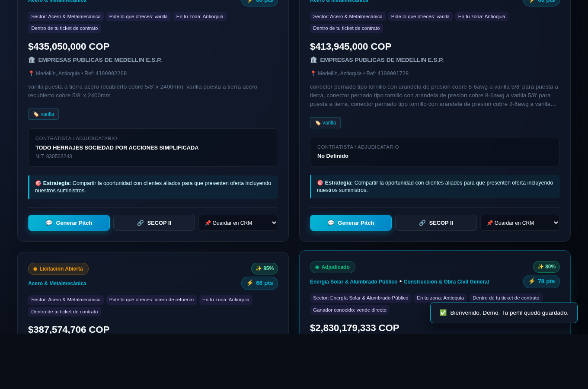

- **Pestaña ✨ Para Ti.** Muestra adjudicados y abiertos juntos, filtrados a afinidad ≥ 55 y ordenados de mayor a menor. Cada tarjeta lleva la etiqueta "✨ 85%" y la lista de razones. Si existe perfil, la aplicación abre esta pestaña por defecto.
- **Afinidad en todas las pestañas.** En Radar B2B y Observatorio también aparece la etiqueta de afinidad; las razones se muestran solo en Para Ti.
- **Pitch personalizado.** El mensaje de contacto generado usa el nombre de la empresa y sus capacidades, y se firma con nombre, NIT y sitio web.
- **Menú de cuenta.** Muestra avatar y nombre, "Mi perfil de oportunidades", "Editar perfil" y "Cerrar sesión".

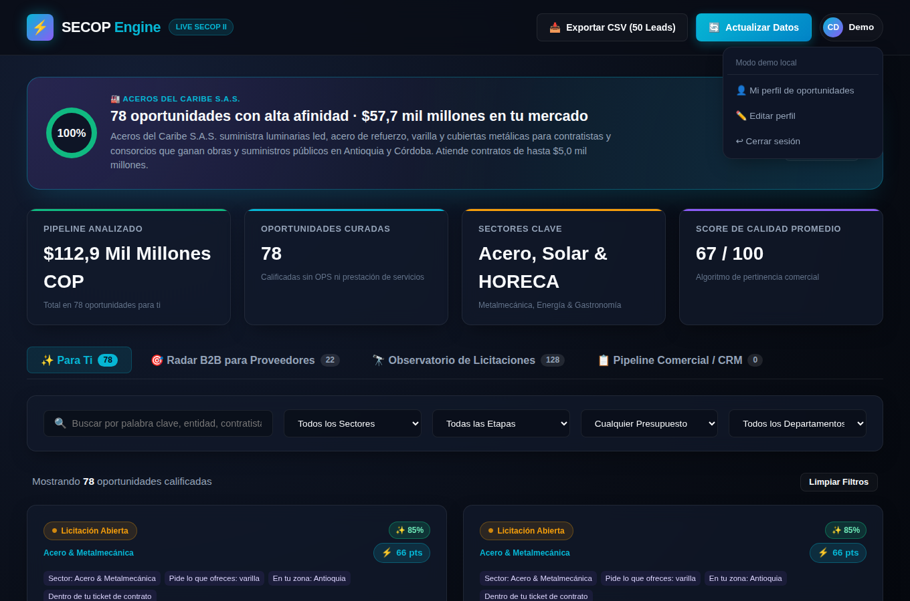

---

## 5. Qué calcula el motor

Todo el cálculo vive en `web/profile-engine.js`: funciones puras, sin DOM, probadas con `node --test`.

### 5.1 Detección de sector (`detectSectors`)

1. Se une el texto libre con las capacidades elegidas y se normaliza (minúsculas, sin tildes).
2. Se buscan las palabras clave de cada sector como palabras completas: "varilla" coincide, pero no dentro de otra palabra.
3. La intensidad de cada sector es `20 × palabras encontradas`, más 40 si el sector se eligió explícitamente, con máximo 100.

### 5.2 Conexiones (`analyzeProfile → connections`)

| Conexión | Cuenta | Ejemplos con nombre | Alcance |
|---|---|---|---|
| 🏆 Contratistas que acaban de ganar | Ganadores distintos en su sector | Los 3 con más valor adjudicado | **Nacional** |
| 🏛️ Entidades compradoras | Entidades distintas | Las 3 con más valor | Zona |
| 🤝 Aliados para consorcio | Consorcios ganadores + procesos que superan su ticket | Nombres de consorcios | Nacional |
| 🧩 Proveedores complementarios | Otros sectores que aparecen junto al suyo | Nombres de esos sectores | Nacional |
| ⚖️ Consultores | Procesos abiertos o en borrador | — | Zona |

**Decisión: las conexiones son nacionales y el mercado es por zona.** En la primera versión todo se calculaba por zona. Un proveedor de acero con zona "Antioquia + Córdoba" veía "0 contratistas ganadores", y el momento wow se perdía. Un ganador en otro departamento sigue siendo un comprador válido, porque los insumos viajan. Por eso las conexiones se buscan en todo el país, mientras los KPIs de mercado respetan la zona.

### 5.3 Recomendaciones por necesidad

Cada una de las 8 necesidades tiene un consejo que usa cifras del mercado del usuario. Algunos ejemplos:
- **Consorcio:** "4 procesos de tu sector superan tu ticket y se pueden abordar en consorcio. Te conectaremos con empresas complementarias de Construcción & Obra Civil."
- **Experiencia (RUP):** "Hay 2 procesos de menor cuantía abiertos: son la ruta más rápida para acumular experiencia habilitante."
- **Capital:** "El contrato típico de tu mercado es de $401 millones. Planea un capital de trabajo del 20–30%…"

⚠️ Los porcentajes de **capital (20–30%)** y **pólizas (~10%)** son reglas generales escritas a mano, no datos. Conviene que alguien con experiencia en contratación pública los valide (§10).

---

## 6. Modelo de afinidad (`matchOpportunity`)

Puntaje de 0 a 100 por cada par perfil ↔ oportunidad.

| Componente | Puntos | Regla |
|---|---|---|
| Sector compartido | +40 | La oportunidad tiene un sector que el perfil también tiene |
| Materiales | +8 por material, máx. +15 | Materiales detectados en la oportunidad que el perfil ofrece |
| Zona | +15 / +10 / 0 | Coincide / perfil nacional o sin zona / fuera de zona |
| Ticket | +15 / +7 / +8 / 0 | Dentro del rango / supera hasta 3× (viable en consorcio) / sin rango definido / fuera |
| Etapa según rol | hasta +10 | Proveedor: adjudicado 10, abierto 7, borrador 6. Contratista y consultor: abierto o borrador 9–10, adjudicado 3 |
| **Tope** | máx. 35 | Si no comparte sector, la afinidad nunca es alta aunque coincidan zona y ticket |

**Umbral de "Para Ti": 55.** Por diseño, sin sector compartido es imposible llegar a ese umbral.

**Ejemplo trabajado** (el caso de la prueba automatizada): un proveedor de acero en Antioquia con ticket de $200M–$1.000M, frente a un contrato adjudicado de $500M en Antioquia que pide "cerchas":
`40 (sector) + 8 (1 material) + 15 (zona) + 15 (ticket) + 10 (adjudicado para proveedor) = 88%`.

---

## 7. Fuerza del perfil

| Criterio | Puntos |
|---|---|
| Rol elegido | 10 |
| Nombre de empresa | 10 |
| Oferta descrita (≥ 40 caracteres) | 15 |
| Al menos un sector detectado | 15 |
| Necesidades | 10 |
| Conexiones | 10 |
| Cobertura geográfica | 10 |
| Ticket | 10 |
| Experiencia **o** RUP | 10 |

Lo que falta se muestra como consejos ("Agrega tu experiencia o registro RUP"). La idea es que una fuerza por debajo del 100% invite a volver a completar el perfil.

---

## 8. Estrategia de desbloqueo (qué se ve antes y después de registrarse)

| Elemento | Sin cuenta | Con cuenta |
|---|---|---|
| Propuesta de valor, KPIs, departamentos, recomendaciones, pitch, palabras clave, fuerza | ✅ Visible | ✅ |
| Conteos y frases de contexto de las conexiones | ✅ Visible | ✅ |
| **Nombres** de ganadores, entidades y consorcios en el perfil | 🔒 Difuminados | ✅ |
| Nombre de la entidad en el top 3 | 🔒 Difuminado (se ven % y valor) | ✅ |
| Guardado del perfil | Solo como borrador en este navegador | Asociado a la cuenta |

**Razonamiento.** Se muestra todo lo que *clarifica* el negocio del usuario (el wow) y se reserva lo que le permite *actuar*: a quién contactar. Así, el registro se presenta como el paso natural para aprovechar lo que ya vio.

⚠️ **El bloqueo es blando. Es una decisión abierta para el revisor:**
- El difuminado es solo CSS: los nombres están en el HTML de la página.
- La pestaña **Para Ti ya funciona con el perfil borrador, sin cuenta**, y ahí las tarjetas muestran entidad y contratista. Los nombres también se ven en las pestañas Radar B2B y Observatorio, que ya eran públicas antes de este cambio.

Con eso, el incentivo real para registrarse hoy es **guardar el perfil**, no acceder a información exclusiva. Para endurecer el bloqueo habría que exigir cuenta para abrir "Para Ti". Pero ocultar datos que el tablero ya muestra públicamente contradice el modelo actual del producto, así que es una decisión de negocio (§10, pregunta 1).

---

## 9. Arquitectura técnica

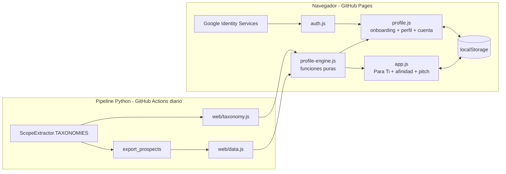

- **Autenticación:** "Sign in with Google" de Google Identity Services, en ventana emergente. Se usan solo los datos básicos de la cuenta: `sub`, nombre, correo, foto y, si existe, el dominio de Google Workspace (`hd`). Si hay `hd`, el campo de sitio web se prellena con ese dominio. No se pide acceso a Gmail ni a otros datos de Google.
- **Sesión y perfiles:** se guardan en `localStorage` con las claves `secop_session`, `secop_profiles` y `secop_profile_draft`. Al iniciar sesión, el borrador anónimo se convierte en el perfil de la cuenta (`adoptDraft`).
- **Modo demo:** si `GOOGLE_CLIENT_ID` está vacío, el botón crea una sesión `demo:local`. Así se puede probar todo el flujo sin configurar Google.
- **Seguridad:**
  - Todo dato dinámico se escapa antes de insertarse en el HTML.
  - El ID token de Google se **decodifica pero no se verifica** en un servidor, porque no hay servidor. Sirve para personalizar, no para autorizar. Nada en la aplicación depende de que la identidad sea auténtica: todos los datos son públicos y los perfiles son locales.
- **Privacidad:** hoy nada sale del navegador. El perfil y el correo no se envían a ningún servidor.

---

## 10. Decisiones, alternativas y limitaciones

### Decisiones y alternativas descartadas

| Decisión | Alternativa descartada | Por qué |
|---|---|---|
| Onboarding antes del registro | Login primero y después el formulario | El registro al principio es la mayor fuga del embudo; el valor previo es lo que pidió el dueño |
| Solo cliente con localStorage | Backend (Supabase/Firebase) ya | Fuera del alcance de esta iteración. El sitio es estático; permite validar la activación sin infraestructura. Es el paso 1 del backlog |
| Insights con reglas y plantillas | Generar textos con un LLM | Sin servidor no hay dónde guardar una clave de API. Las reglas son deterministas, testeables y gratis. Un LLM es una mejora natural cuando exista backend |
| Taxonomía generada desde Python | Copiar las palabras clave en JS | Evita que el perfil y las oportunidades hablen vocabularios distintos |
| Conexiones nacionales, mercado por zona | Todo por zona | Las zonas pequeñas dejaban conexiones en 0 y mataban el wow (§5.2) |
| Chips para necesidades y conexiones | Preguntas abiertas | Más rápido de responder y estructurado para poder conectar perfiles en el futuro |

### Limitaciones y observaciones conocidas

1. **Sin backend:** el perfil vive en un solo navegador. No hay conexiones reales *entre* usuarios, ni perfiles en varios dispositivos, ni alertas.
2. **Dataset pequeño (~150 procesos):** en perfiles de nicho los números son modestos. La frase de "Proveedores complementarios" puede quedar débil ("2% de tus oportunidades…").
3. **Falso positivo de taxonomía:** "varilla" coincide con "varilla puesta a tierra… cobre" (procesos de EPM). Estos aparecen como oportunidades de acero con 85% de afinidad. Se corrige en el pipeline (ver HANDOFF, backlog 2).
4. **Ganadores atípicos:** algunos "contratistas ganadores" son empresas de servicios públicos (E.S.P.), que quizá no compran insumos como un contratista privado.
5. **Orden en la propuesta de valor:** las capacidades elegidas con chips van antes que las detectadas en el texto. Si alguien marca un chip secundario (por ejemplo "luminarias led"), este aparece primero en su propuesta.
6. **`fecha_publicacion` vacía** en los datos, así que aún no se puede mostrar urgencia ("cierra en N días").
7. **Parpadeo al cargar:** con un perfil existente, la pestaña activa cambia de "Radar B2B" a "Para Ti" al cargar, con una transición de unos 0,25 s.
8. **Sin analítica:** no hay forma de medir el embudo (§11).
9. **CRM global:** `secop_crm_state` no está separado por usuario.

---

## 11. Métricas propuestas (no implementadas)

Para validar el diseño hace falta instrumentar el embudo. Se sugiere medir:

| Métrica | Definición |
|---|---|
| Inicio de onboarding | Clics en "Crear mi perfil" / visitantes |
| Finalización por paso | % que pasa de cada paso al siguiente (el 2 es el de mayor riesgo porque exige detectar sector) |
| Conversión a cuenta | Inicios de sesión con Google / perfiles completados sin cuenta |
| Activación | Usuarios con cuenta que abren "Para Ti" y generan un pitch o guardan en CRM en la primera sesión |
| Calidad de detección | % de onboardings donde el paso 2 no detecta sector al primer intento |

---

## 12. Preguntas abiertas para el revisor

1. **¿Qué tan duro debe ser el bloqueo?** Hoy es blando (§8). ¿Exigimos cuenta para abrir "Para Ti", o para ver los nombres en el tablero público?
2. **¿Los 3 roles son los correctos?** ¿Falta, por ejemplo, "Entidad pública" o "Financiador/Aseguradora"?
3. **Necesidades y conexiones:** ¿las 8 necesidades y los 5 tipos de conexión cubren lo que se quiere conectar después? Esta lista define el modelo de datos del emparejamiento futuro entre perfiles.
4. **Umbral y pesos de afinidad:** ¿55 es el corte adecuado? ¿El sector debe pesar 40 de 100?
5. **Reglas de negocio escritas a mano:** ¿son correctos los rangos de capital (20–30%) y pólizas (~10%)? ¿Se deben mostrar?
6. **Tono y textos:** ¿la propuesta de valor y el pitch suenan como hablaría el cliente? ¿Los hacemos editables?
7. **Siguiente paso:** ¿backend primero (conexiones reales), o limpieza de datos primero (falsos positivos y fechas) para que el wow sea más confiable?

---

## 13. Cómo probarlo

```bash
python -m http.server 8000 --directory web   # abrir http://localhost:8000
node --test tests/profile_engine.test.js      # 6 pruebas del motor
python -m unittest discover tests             # 7 pruebas Python
```

**Recorrido sugerido:**
1. Clic en "Crear mi perfil gratis" y elegir el rol Proveedor.
2. Escribir *"Fabricamos estructuras metálicas, cerchas y cubiertas; suministro de acero de refuerzo y varilla"*.
3. Elegir necesidades y conexiones, y luego "Antioquia" y un ticket.
4. Revisar el perfil bloqueado.
5. Clic en "Continuar con Google (modo demo)" para ver el perfil desbloqueado y después "Ver mis N oportunidades".

Para volver a empezar, borrar las claves `secop_*` de `localStorage` desde las herramientas de desarrollo del navegador.
