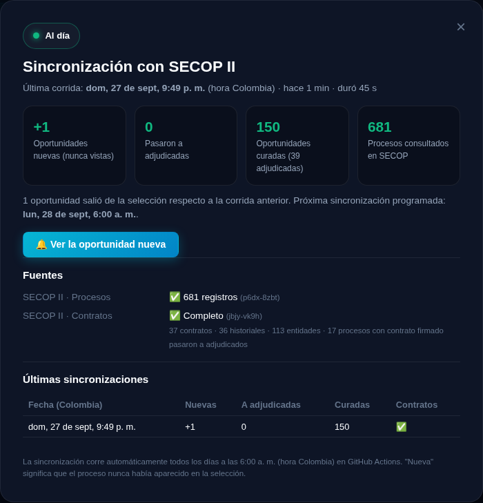

# Handoff: Cuentas con Google y Perfil de Oportunidades

Última actualización: 2026-09-28 · Rama: `claude/gmail-oauth-account-creation-t7o73y` (sin PR, por decisión del dueño).

> **Estado de la última sesión (Claude o Antigravity):** [`ESTADO.md`](./ESTADO.md). Léelo primero.
>
> Documento de diseño detallado, con capturas, dirigido al revisor humano: [`DISENO_PERFILES.md`](./DISENO_PERFILES.md).

## Objetivo del producto

Que las empresas creen cuentas con Google y perfiles completos para conectarlas con oportunidades de SECOP II. El "momento wow" debe llegar **antes** de conectar oportunidades externas: clarificar qué ofrece la empresa, qué necesita, qué busca y con quién debería conectarse, con suficiente valor para incentivar el registro y la activación.

## Qué está hecho

**Flujo de activación**
1. Un visitante sin cuenta abre el onboarding desde el banner (`#profileHero`) o la pestaña "✨ Para Ti".
2. Hay 4 pasos: rol → oferta (texto libre y sugerencias) → necesidades y conexiones → cobertura, ticket, experiencia y RUP.
   - En el paso 2 el sector se detecta en vivo.
   - En todos los pasos una barra muestra cuántos procesos y pesos coinciden con el perfil.
3. Al terminar se abre el **Perfil de Oportunidades** con:
   - Propuesta de valor, KPIs de mercado y cliente ideal.
   - Conexiones identificadas y recomendaciones por necesidad.
   - Pitch de 30 segundos, palabras clave para alertas, top 3 oportunidades y fuerza del perfil.
4. Sin sesión, los nombres de empresas aparecen difuminados (`.soft-lock`, `.example-list.locked`). La llamada a la acción es guardar con Google.
5. Al iniciar sesión, `adoptDraft` convierte el borrador en el perfil de la cuenta. Luego se desbloquea todo, se activa la pestaña "Para Ti" (umbral de afinidad `MIN_MATCH_SCORE = 55` en `app.js`) y los pitches se firman con los datos de la empresa.

**Modelo de afinidad** (`matchOpportunity`, 0-100)
- Sector compartido: +40.
- Materiales coincidentes: hasta +15.
- Zona: +15 si coincide, +10 si la cobertura es nacional o no está definida.
- Ticket: +15 dentro del rango, +7 si lo supera hasta 3×, +8 si no está definido.
- Etapa según rol (`ROLES[rol].stageFit`): hasta +10.
- Sin sector compartido, el máximo es 35.

**Decisiones clave**
- El sitio es estático (GitHub Pages), así que la autenticación es del lado del cliente con Google Identity Services. El ID token se **decodifica pero no se verifica**: sirve para personalizar, no para autorizar.
- Las conexiones (ganadores, consorcios, sectores complementarios) se calculan **a nivel nacional**. Los KPIs de mercado se calculan **en la zona** del perfil. Así una zona pequeña no deja el perfil vacío.
- La taxonomía se genera desde Python (`export_taxonomy`) para no duplicar vocabulario.

**Validación realizada**
- `node --test tests/profile_engine.test.js`: 15 pruebas OK.
- `python -m unittest discover tests`: 32 pruebas OK.
- Recorrido completo en Chromium (Playwright), a 1360 px y 390 px de ancho: onboarding, perfil bloqueado, inicio de sesión demo, perfil desbloqueado, "Para Ti", pitch, recarga con persistencia y cierre de sesión. Sin errores de JavaScript.

**Fechas en las fichas (2026-09-28)**. Detalle y propuesta de siguientes pasos en [`PROPUESTA_FICHAS.md`](./PROPUESTA_FICHAS.md).
- El pipeline extrae el cierre de ofertas, la adjudicación, el plazo y señales de competencia (`fechas`, `plazo`, `competencia`), y registra en el log la cobertura de cada campo.
- `ProfileEngine.bidWindow` decide el estado real de cada proceso: abierta, borrador, cerrada o adjudicado. Lo usan la ficha, el perfil y la afinidad.
- Las fichas muestran una cuenta regresiva al cierre y marcan los adjudicados de más de 90 días como antiguos.
- Hay orden por cierre, recientes o valor, y la cabecera muestra cuándo se actualizaron los datos.

**Cruce con contratos y rediseño de fichas (2026-09-28)**. Detalle en [`PROPUESTA_FICHAS.md`](./PROPUESTA_FICHAS.md) §9.
- `src/enrichers/contract_enricher.py` cruza con SECOP II Contratos (`jbjy-vk9h`) por `proceso_de_compra = id_del_portafolio` y agrega `contrato`, `historial_contratista` y `entidad_stats`. No guarda documentos, datos bancarios ni género.
- Los procesos con contrato firmado pasan a adjudicados: el Radar B2B pasó de 22 a unos 38–39 leads.
- Ficha nueva con badges (`ProfileEngine.cardBadges`, convención por tono), próximo paso (`ProfileEngine.nextStep`), vista de detalle con cronograma y contactos por rol, y guía de badges.
- No hay API de DeepSeek (ni de otro LLM) configurada en el repo ni en el entorno. La planeación se hizo sin ella.
- **Aprendizaje:** en `app.js`, toda constante usada por las fichas debe declararse al inicio del callback, antes del primer `renderView()`. Si no, se produce un error de "temporal dead zone" y no se pinta ninguna ficha. Pasó dos veces.

**Estado de sincronización con SECOP (2026-09-28)**
- El botón "Actualizar Datos" era falso: solo mostraba un aviso de "sincronizado". Lo reemplaza un indicador real en la barra superior.
  - Verde: datos de menos de 30 h. Ámbar: menos de 54 h. Rojo: más antiguos.
  - Su panel muestra la última corrida (hora Colombia, duración), los procesos consultados, las oportunidades curadas, nuevas, salidas y nuevas adjudicadas, el estado de cada fuente, los errores, la próxima corrida y el historial de las últimas 10.
- "Nueva" significa nunca vista en la selección (registro persistente `data/seen_ids.json`). Tiene badge 🔔 y un filtro "solo nuevas".
- Herramienta de diagnóstico `src/tools/probe_sources.py` y workflow manual `probe_sources.yml` para explorar datasets desde Actions.

**Diseño de créditos IA (2026-09-28):** en [`CREDITOS_IA.md`](./CREDITOS_IA.md), pendiente de decisiones del dueño (§9). Incluye:
- qué es gratis en lote y qué va bajo demanda;
- el monedero (reserva, cobro y reembolso, con caché compartida);
- la arquitectura con Supabase;
- el análisis de anexos (dataset `dmgg-8hin` verificado);
- el perfil con skills;
- los datasets confirmados por el diagnóstico: ofertas `wi7w-2nvm`, consorcios `ceth-n4bn`, PAA `9sue-ezhx` y multas `4n4q-k399`.

**Fuentes abiertas gratuitas para la demo (2026-09-28).** `src/enrichers/open_sources.py`, verificado con datos reales:
- **Ofertas por proceso:** 14 procesos con ofertas; badge "👥 N ofertas" y tabla de competencia con el ganador marcado.
- **Integrantes de consorcios:** los 5 consorcios, con porcentaje, líder y trayectoria.
- **Sanciones SECOP I:** 0 coincidencias hoy. Es SECOP I y puede no cubrir sanciones recientes.
- **Compras planeadas del PAA:** 80 en los sectores del motor, en la pestaña "🗓️ Planeadas (PAA)". Una consulta por prefijo UNSPSC (una sola consulta excedía el tiempo de espera). Se descartan valores mayores a $1 billón, que son errores de digitación.
- Cada fuente reporta su estado en el panel de sincronización y reutiliza la corrida anterior si falla.
- **Siguientes pasos:** en [`PLAN_ITERACIONES.md`](./PLAN_ITERACIONES.md). **Guion de la demo:** en [`GUION_DEMO.md`](./GUION_DEMO.md).

## Pendiente del dueño (bloquea el login real)

- [ ] Crear un ID de cliente OAuth 2.0 tipo "Aplicación web" en Google Cloud Console.
  - Orígenes autorizados: `https://andres-solanor.github.io` y `http://localhost:8000`.
  - Pegar el ID en `web/config.js` → `GOOGLE_CLIENT_ID`.
- [ ] Configurar la pantalla de consentimiento de OAuth (alcances `openid email profile`).

Hasta entonces el botón funciona en **modo demo** (`id: 'demo:local'`).

## Backlog priorizado

1. **Backend de perfiles (Supabase o Firebase).** Es necesario para la promesa central de conectar perfiles entre sí.
   - Verificar el `credential` de Google en el servidor.
   - Persistir perfiles y CRM por usuario, con uso multi-dispositivo.
   - Migrar los datos de `localStorage` en el primer inicio de sesión.
   - Punto de integración: `saveProfile` y `getProfile` en `web/profile.js`, y `handleCredential` en `web/auth.js`.
2. **Falsos positivos de taxonomía.**
   - "varilla" coincide con "varilla puesta a tierra… cobre" (procesos de EPM) y los clasifica como acero.
   - Revisar también "pae" y "vigas".
   - Agregar términos de exclusión por sector en `ScopeExtractor`, con pruebas.
3. **Fichas: siguientes cruces** (fases 4–5 de [`PROPUESTA_FICHAS.md`](./PROPUESTA_FICHAS.md) §9.4): proveedores registrados, proponentes por proceso, PAA e integrantes de consorcios. Las fases 0–3 (fechas, cruce con contratos, rediseño con badges y detalle) ya están hechas.
   - Leads viejos: 12 de los 22 adjudicados tienen más de 90 días. La consulta 4 de `export_prospects` debería filtrar por `fecha_adjudicacion` reciente.
   - Las fechas faltan en los borradores (22 de 23 sin publicación), lo cual es esperado.
4. **Alertas diarias por correo** con `analysis.alertKeywords` del perfil. Requiere backend.
5. **Contacto de contratistas ganadores cruzando con RUES.** Hoy el pitch no tiene destinatario.
6. **Más datos:** el pipeline cura unos 150 procesos, así que perfiles de nicho o de zonas pequeñas ven poco mercado. Subir `limit` y cuotas en `build_curated_dataset`.
7. **Mejoras menores del perfil:**
   - Editar la propuesta de valor a mano.
   - Compartir el perfil público por enlace.
   - Guardar un CRM por usuario (hoy `secop_crm_state` es global).

## Dónde tocar según la tarea

| Tarea | Archivo / función |
|---|---|
| Cambiar pesos de afinidad | `web/profile-engine.js` → `matchOpportunity` (y ajustar `tests/profile_engine.test.js`) |
| Nuevos textos o insights del perfil | `web/profile-engine.js` → `analyzeProfile` |
| Nuevas necesidades o conexiones | `NEEDS` / `CONNECTIONS` en el motor, y sus builders en `analyzeProfile` |
| Pasos del onboarding | `web/profile.js` → `STEPS`, `wizardStepHtml`, `canAdvance`, `bindWizard` |
| Vista del perfil | `web/profile.js` → `openProfileView` |
| Login y sesión | `web/auth.js` |
| Pestaña "Para Ti" y tarjetas | `web/app.js` → `getFilteredData`, `createCardHtml`, `getMatch` |
