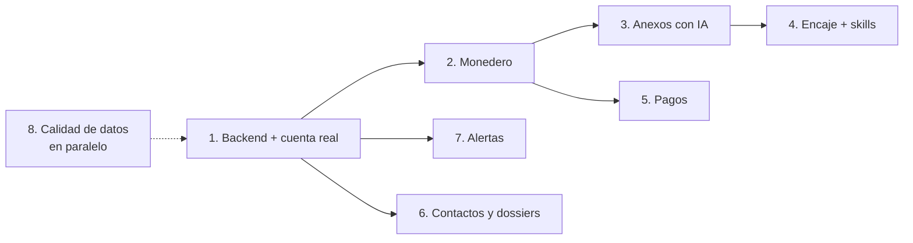

# Plan de iteraciones futuras

> **Para quién es este documento.** Para el dueño del producto (priorización y decisiones) y para el agente que implemente cada iteración. Cada iteración trae objetivo, alcance, criterios de aceptación, dependencias y riesgos.
> Diseño de detalle en [`CREDITOS_IA.md`](./CREDITOS_IA.md), [`PROPUESTA_FICHAS.md`](./PROPUESTA_FICHAS.md) y [`DISENO_PERFILES.md`](./DISENO_PERFILES.md). Estado actual en [`HANDOFF.md`](./HANDOFF.md). Guion de la demo en [`GUION_DEMO.md`](./GUION_DEMO.md).

**Fecha:** 2026-09-28. **Tallas:** S ≈ 1–2 días · M ≈ 3–5 días · L ≈ 1–2 semanas (una persona con asistencia de IA).

---

## Visión y prioridades (sesión de co-creación del 2026-10-01)

Respuestas del dueño en la sesión. Este bloque **manda sobre el "Orden recomendado"** del final mientras no se revise.

**El producto es un módulo del motor de conexiones.** El motor ya existe como prototipo en otro código, hecho rápido y con mucho por mejorar (ruta y alcance `[POR VERIFICAR]`). El tablero de SECOP sirve para tres cosas:
1. Captar leads: empresas, consultores y otros actores que dejan su oferta y sus necesidades.
2. Conectar pares entre sí.
3. Mostrar a cada uno las oportunidades del Estado para lo que ofrece, y también las que crean los **ganadores de contratos**, que van a necesitar sus insumos o capacidades para cumplir.

**Para quién se construye ahora:**

| # | Segmento | Qué necesita | Estado |
|---|---|---|---|
| 1 | Firma de abogados que prepara a personas y empresas para licitar | Varias empresas cliente por cuenta; lista corta por cliente con fechas, requisitos y competencia | Prioridad de la demo |
| 2 | Quienes estructuran proyectos con los decisores del Estado | Visibilidad temprana: PAA, historial y cifras de la entidad | **En descubrimiento.** El dueño aún no sabe cómo trabajan. No se diseña nada específico hasta entrevistarlos (ver "Preguntas abiertas") |
| 3 | El dueño, sus clientes y aliados | Mapear oportunidades por oferta | Ya lo cubre el tablero |

**Modelo de negocio:** primero gratis y cobrar después. Se maximizan usuarios, leads y calidad de datos, y el modelo de cobro se elige con datos de uso. El monedero y los pagos (iteraciones 2 y 5) bajan de prioridad. Siguen documentados.

**Orden de trabajo acordado:**
1. **Fase A, próximas 2–3 semanas:** pulir el tablero y la calidad de datos, sin cabos sueltos, y armar dos demos de impacto (la firma de abogados y "de ganadores a proveedores"). Todo sin backend.
2. **Fase B:** con el frente pulido, desbloquear lo potente: backend, cuenta real y captación de leads.
3. **Fase C:** planear la IA (piloto de anexos) sobre ese backend.

### Fase A: pulido, datos y dos demos (sin backend)

| # | Tarea | Talla | Detalle |
|---|---|---|---|
| A1 | ~~9.6 (b) móvil a 390 px~~ | S | **Hecho (2026-10-01, rama `pro/mobile-390`).** Hasta 560 px de ancho: la barra deja de ser fija y pasa de cuatro filas (228 px) a dos (118 px): marca y cuenta arriba; sincronización, tema y CSV abajo, con CSV solo con ícono. Los KPI usan 2 columnas: los pesos y el sector (que con un filtro muestra un nombre largo) van cada uno en su fila; oportunidades y score van lado a lado. Los botones de la ficha ya no parten "🔎 Detalle". La etiqueta de persona natural ya no se cortaba. Pruebas de humo a 390 y 360 px |
| A2 | ~~9.5 (1) fichas en páginas~~ | S–M | **Hecho (2026-10-01, rama `pro/pagination`).** Se pintan 60 fichas (`DashboardEngine.PAGE_SIZE`) y "Ver 60 más (N sin mostrar)" agrega la siguiente página; el foco pasa a la primera ficha nueva. El límite vuelve a una página al cambiar de pestaña, filtro u orden. Un enlace `#op=` a una ficha posterior amplía el límite hasta pintarla. Pintado al cambiar de pestaña (JS + layout, mediana de 5, a 1360 px, con los datos del repositorio): Radar de 298 a 79 ms; Observatorio de 279 a 63 ms; PAA de 58 a 40 ms; fuera del tablero (1500 fichas) de 1277 a 50 ms. Primera carga hasta ver fichas: de 4,2 a 0,8 s, en una sola medición |
| A3 | Cabos sueltos de datos | S | **Hecho (2026-10-01, rama `pro/loose-ends`):** • "(0%)": muestra "<1%" cuando la parte es positiva (`pctLabel`). • "vigas": muestra de 25 procesos de SECOP II por consulta de lectura; casi siempre es concreto (columnas, vigas de amarre o de arrastre). Se excluye con `excluir_si`, sin tocar la consulta de descarga. Taxonomía v3. • Tuluá: verificado en SECOP II. "CONVOCATORIA PÚBLICA 330.20.5.21-2026" (suministro de energía para alumbrado público) figura como **Mínima cuantía** con precio base de $6.800.000.000 y estado "Aprobado". Una versión anterior de $6.100 millones se canceló el 2026-01-19. El motor refleja la fuente; la inconsistencia está en lo que registró la entidad. **Pendiente, con decisión del dueño** (cambia qué se publica): PAA más preciso y cobertura de sanciones de SECOP II |
| A4 | ~~Peso del repositorio~~ | S | **Hecho (2026-10-01, rama `pro/pages-artifact`, con el visto bueno del dueño).** Medido antes del cambio: • Cada refresco guardaba en git entre 1,5 y 2 MB comprimidos (`data.js`, `prospects.json`, `hidden.js` y el CSV, de 0,35 a 0,45 MB cada uno, casi sin delta). • Proyección: unos 0,6 GB al año, y más con A5 (2). **Ahora** Pages publica desde un artefacto (`deploy-pages@v5`). El estado de la corrida anterior se descarga del sitio publicado y el bot ya no hace commits. **Alternativas descartadas:** • Rama de datos con force-push: más piezas, y git igual guarda los datos. • Reescribir la historia: riesgoso con tres worktrees. |
| A5 | 9.5 (6) y (2) | S | `noticeUID` en vez de la URL completa y toda la lista fuera del tablero en `hidden.js` |
| A5 (6) | ~~`noticeUID` en `hidden.js`~~ | S | **Hecho (2026-10-01, PR #14).** Corrida real: 1472 de 1500 registros con `notice_uid`; `hidden.js` −119.232 B (−8,2 %). **(2) Hecho** (aprobado por el dueño: "si no rompe el navegador ni la experiencia"). `HIDDEN_WEB_MAX` pasa de 1500 a 5000, que funciona como techo de seguridad. **Medición:** corrida real de la noche del 2026-10-01: 6033 fuera del tablero, 5000 publicados. `hidden.js` pesa 4.497.430 B (695.384 B en gzip). Al abrir la vista (descarga, parseo y primer pintado), de 1500 a 5000: • escritorio: de 311 a 302 ms; • teléfono con CPU 4× más lenta: de 0,91 a 1,21 s; • memoria: de 11 a 17–18 MB. Filtrar en el teléfono subía de 0,48 a 0,76 s **por tecla**. Por eso la búsqueda espera 200 ms a que se deje de escribir (`SEARCH_DEBOUNCE_MS`). Esa corrida descargó 9624 procesos, frente a 7125 en las de la tarde; la causa queda `[POR VERIFICAR]` |
| A6 | ~~**Demo firma de abogados**~~ (hecho el 2026-10-01, rama `pro/firm-demo`: "🏢 Empresas cliente" en el menú de cuenta, con agregar, usar y quitar; el perfil activo mueve "Para Ti", la afinidad y el hero, que dice "Empresa cliente: X"; "📄 Lista corta" imprimible con las 15 de mayor afinidad, primero lo abierto y por cierre, con próximo paso y enlace a SECOP. No muestra "0 ofertas" en procesos abiertos, porque SECOP no revela las ofertas antes del cierre) | M | Varias **empresas cliente** por usuario (selector en el menú de cuenta; hoy `secop_profiles` guarda un perfil por usuario). Una vista imprimible por empresa cliente con su lista corta: fechas, estado, competencia (ofertas) y próximo paso. Los requisitos del pliego llegan con la IA (fase C); mientras tanto la vista enlaza el proceso en SECOP |
| A7 | ~~**Demo de ganadores a proveedores**~~ (hecho el 2026-10-01, rama `pro/winners-suppliers`: `compra_a` en la taxonomía para obra civil, agua, energía, PAE y HORECA; "🧩 Qué puede necesitar el ganador" en el detalle de lo adjudicado; +35 en la afinidad, ver `DISENO_PERFILES.md` §6. Ajuste (decisión delegada por el dueño): el ganador cuenta solo si se adjudicó hace 90 días o menos y su contrato no ha terminado; obra civil deja de apuntar a dotación. Un perfil de acero pasa de 21 a 89 en "Para Ti") | M | En lo adjudicado: quién ganó, por cuánto y qué insumos suele necesitar ese tipo de contrato. Un mapa sector → insumos en `config/taxonomy.json` (por ejemplo, obra civil → acero, maquinaria, señalización), con su prueba; nada de listas en JS. En "Para Ti": "ganadores que pueden comprarte", cruzando la oferta del perfil con ese mapa. El texto lo dice claro: es una posibilidad comercial, no una necesidad confirmada |
| A8 | `GOOGLE_CLIENT_ID` real | S | El dueño crea el cliente OAuth en Google Cloud (orígenes: el dominio de GitHub Pages y `localhost`) y entrega el ID, que es público |
| A9 | 9.6 (c) identidad visual | M | Con tope de tiempo y solo si el dueño aprueba la dirección. Va después de las demos y antes de la fase B ("lo potente, con el frente pulido") |

### Fase B: backend y captación de leads

**Opciones de backend.** El dueño ya paga Hostinger, plan **Hosting Web Empresarial** (hosting compartido). Supabase tiene un año gratis que se activa al decidir.

| | Hostinger Empresarial | Supabase |
|---|---|---|
| Qué corre | **Leído en hPanel el 2026-10-01** (detalles del plan de `analytikz.com.co`, que ya es una app Node): • Apps web Node.js 24, 22, 20 y 18, con Express, Fastify, Hono o NestJS; despliegues y variables de entorno en el panel. • MySQL, con acceso remoto y phpMyAdmin. • SSH, inactivo, se activa en el panel. • 3 GB de RAM, 2 núcleos, 50 GB y hasta 50 sitios. • En el menú de la app Node no aparece cron `[POR VERIFICAR]`. | Postgres, autenticación con Google, funciones y políticas por fila |
| Costo extra | Ninguno, ya está pagado | Gratis un año; después `[POR VERIFICAR]` |
| Trabajo | Escribir a mano la verificación del token de Google (JWKS), las sesiones y los permisos | Viene hecho; el trabajo es configurar |
| Riesgo | Seguridad propia y PHP: un segundo lenguaje en el repositorio | Dependencia de un tercero; el reloj del año gratis |

**Antes de decidir:** una exploración de un día en Hostinger, en un subdominio nuevo (por ejemplo `api.analytikz.com.co`), con una app Node (Hono o Express). La app valida un ID token de Google contra las llaves públicas de Google y guarda un lead en MySQL. Como es Node y no PHP, el repositorio no suma un segundo lenguaje: el backend sería JavaScript, como la web. Si sale bien, Hostinger alcanza para la fase B. Si la IA de la fase C necesita procesos largos (descargar y leer pliegos de 51 MB), esa parte puede seguir en GitHub Actions.

**Alcance de la fase B:** la iteración 1 (cuenta real, perfiles y CRM en el servidor), más:
- **Captación de leads:** el perfil de visitante (`secop_profile_draft`), con oferta y necesidades, se guarda en el servidor con consentimiento explícito (Ley 1581 de 2012). Es la puerta de entrada al motor de conexiones.
- **Esquema de perfil compartido** con el motor de conexiones: un solo contrato de datos (oferta, necesidades, sectores, zonas, NIT), para que el prototipo existente lo pueda leer. Para definirlo hay que revisar ese código.

### Largo plazo: el motor de conexiones

1. **Identidad y perfil únicos** entre módulos: un usuario y un perfil, aunque cada módulo tenga su propia vista.
2. **Conexión entre pares:** cruce oferta ↔ necesidad entre perfiles, con la misma lógica de afinidad de `profile-engine.js`, ampliada.
3. **Red de subcontratación:** ganadores ↔ proveedores, con el historial de contratos (`jbjy-vk9h`) y consorcios (`ceth-n4bn`) como evidencia de quién trabaja con quién.
4. **IA:** análisis de anexos (iteración 3) y encaje (iteración 4), que convierten "puede interesarte" en "esto te piden y esto te falta".
5. **Alertas** (iteración 7): lo que trae de vuelta a los usuarios.
6. **Monetización:** se decide con datos de uso. Opciones ya diseñadas: créditos (iteración 2) o suscripción.

### Lista de deseos (investigar después)

Ideas del dueño para una sesión futura. No hay trabajo hecho todavía.

- **Croma** (pedido del 2026-10-01): ver qué se puede integrar de Croma (documentación: https://docs.usecroma.com/introduction) y leer los aprendizajes de la hackatón en `C:\Users\abner\Claude\Projects\Hackaton croma` (carpeta local del dueño, fuera del repositorio). Qué es Croma y cómo encaja `[POR VERIFICAR]`: no se ha leído ninguna de las dos fuentes.

### Preguntas abiertas de la sesión

- **Segmento 2:** ¿cómo trabajan? Proponer 3 o 4 entrevistas antes de diseñar. Preguntas: qué miran primero, en qué etapa entran (PAA, borrador, abierto), qué información les falta hoy y qué no deberían ver en una herramienta. Línea de producto mientras tanto: solo datos públicos y visibilidad temprana; nada que perfile a funcionarios como personas.
- **Motor de conexiones:** ¿dónde está el código del prototipo? ¿Qué usuarios y qué esquema de perfil tiene? Hace falta para el esquema compartido de la fase B.
- **Demo de la firma:** ¿hay una firma real dispuesta a probarla? Con una empresa cliente de verdad, la demo usa datos reales y no inventados.

---

## 0. Punto de partida (lo que ya está en la demo)

Sitio estático en GitHub Pages con sincronización diaria desde SECOP II. Incluye:
- **Perfiles:** onboarding de 4 pasos, Perfil de Oportunidades, login con Google (modo demo) y afinidad.
- **Fichas:** fechas, estado real, badges, próximo paso y detalle.
- **Cruce con contratos:** fechas de ejecución, representante legal, trayectoria y datos de la entidad.
- **Fuentes abiertas gratuitas:** ofertas (competencia), integrantes de consorcios, sanciones y compras planeadas (PAA).
- **Estado de la sincronización:** nuevas, salidas, historial y estado de cada fuente.

**Límites conocidos de la demo:**
- No hay backend. Perfiles y CRM viven en el navegador y el login de Google no se verifica en un servidor.
- La IA y los créditos no existen todavía.
- Los datos personales de contacto se omiten por completo.

---

## Iteración 1: Backend mínimo y cuenta real · **L**

**Objetivo:** que la cuenta con Google sea real y que el perfil acompañe al usuario en cualquier dispositivo.

**Alcance:**
- Supabase (decisión pendiente frente a Firebase): verificación del ID token de Google e inicio de sesión con ese token.
- Tablas `profiles` y `crm_items` por usuario, con migración automática de `localStorage` en el primer inicio de sesión.
- Configurar el `GOOGLE_CLIENT_ID` real (hoy en modo demo).
- Políticas de acceso por fila: cada usuario lee y escribe solo lo suyo.

**Criterios de aceptación:**
- Iniciar sesión en dos navegadores muestra el mismo perfil y el mismo CRM.
- Un token manipulado desde el navegador no da acceso.
- El sitio sigue funcionando sin sesión para todo lo público.

**Depende de:** decisión de backend. **Riesgos:** configuración de OAuth y orígenes autorizados.

---

## Iteración 2: Monedero de créditos (sin pagos) · **M**

**Objetivo:** tener la mecánica de créditos funcionando antes de cobrar.

**Alcance:**
- Ledger append-only (`credit_transactions`) con bono de bienvenida, reserva, cobro y reembolso, y claves de idempotencia.
- Saldo visible en el menú de cuenta; cotización previa ("esta acción cuesta N créditos").
- Límites diarios por cuenta y una sola bonificación por cuenta verificada.

**Criterios de aceptación:**
- Un trabajo fallido reembolsa automáticamente.
- Dos clics seguidos no cobran dos veces.
- El saldo siempre coincide con la suma del ledger.

**Depende de:** iteración 1 y decisión del valor del crédito y del bono (`CREDITOS_IA.md` §9).

---

## Iteración 3: Análisis de anexos con IA (piloto) · **L**

**Objetivo:** extraer de los anexos de SECOP lo que el contrato necesita, con evidencia por página.

**Alcance:**
1. **Validación previa (S):** comprobar que `url_descarga_documento` de `dmgg-8hin` descarga sin sesión ni captcha y con qué límites. Medir tokens por página en 10 pliegos reales.
2. Selección automática de documentos relevantes (estudios previos, pliego, anexo técnico, presupuesto, formatos).
3. Extracción con salida estructurada y citas: necesidades (ítems y cantidades), requisitos habilitantes, garantías, criterios de evaluación, cronograma y riesgos.
4. Caché compartida por proceso y hash de los archivos.
5. Evaluación con 10–20 pliegos anotados a mano (precisión de requisitos y cantidades) para elegir entre Claude Opus 5 y Sonnet 5.

**Criterios de aceptación:**
- 90% o más de precisión en requisitos habilitantes sobre el conjunto de evaluación.
- Cada dato con documento y página.
- Costo medido por análisis dentro del precio en créditos.

**Depende de:** iteración 2 y decisión del modelo. **Riesgos:** descargas bloqueadas, archivos de más de 32 MB (hay uno real de 51 MB), PDFs escaneados.

---

## Iteración 4: Encaje perfil ↔ contrato y skills de perfil · **M**

**Objetivo:** que el usuario vea qué le piden, qué cumple y qué le falta, y que su perfil tenga evidencia real.

**Alcance:**
- Skill `experiencia-rup`: agrupa los contratos del NIT por código UNSPSC y valor.
- Skill `perfil-empresa`: propuesta de valor con evidencia (contratos, sitio web). El usuario aprueba cada cambio.
- "Encaje" en la ficha y el detalle (✅ cumples, ⚠️ te falta, 🧩 aliados sugeridos a partir de ofertas y consorcios) y skill `pitch-oportunidad`.

**Criterios de aceptación:** ninguna afirmación del perfil sin evidencia; lo que no tiene evidencia se marca "por confirmar".

**Depende de:** iteración 3 (para el encaje). Las skills de perfil pueden ir antes.

---

## Iteración 5: Pagos · **M**

**Alcance:**
- Pasarela local (Wompi o Mercado Pago: PSE, tarjetas, Nequi), paquetes de recarga y webhooks idempotentes que acreditan créditos.
- Historial de compras y facturación electrónica.

**Depende de:** iteración 2 y decisión de pasarela. **Riesgos:** requisitos tributarios y de facturación.

---

## Iteración 6: Contactos y dossiers con cuenta · **M**

**Objetivo:** desbloquear con la cuenta (o con créditos) lo que hoy se omite por privacidad.

**Alcance:**
- Dossier de aliado o competidor: historial, consorcios, ofertas, sanciones y resumen redactado por IA.
- Contactos institucionales de la entidad (PAA) y de grupos (`ceth-n4bn`), servidos desde el backend y solo a usuarios con cuenta, con nota legal, finalidad y registro de consultas.
- Bloqueo "duro" del Perfil de Oportunidades (hoy es solo visual; ver `DISENO_PERFILES.md` §8).

**Depende de:** iteración 1 y **revisión legal** (Ley 1581 de 2012).

---

## Iteración 7: Alertas · **M**

**Alcance:**
- Correo o WhatsApp diario después de la sincronización (6:00 a. m.) con nuevas oportunidades afines, cierres próximos y compras planeadas del sector.
- Configuración por perfil (palabras clave de `analysis.alertKeywords`, zonas, ticket).

**Criterios de aceptación:** una alerta por usuario y día como máximo, con enlace directo a la ficha, y la opción de darse de baja.

**Depende de:** iteración 1.

---

## Iteración 8: Calidad y volumen de datos (en paralelo, sin backend) · **S–M**

Estas mejoras se pueden hacer en cualquier momento:

| Tarea | Talla | Detalle |
|---|---|---|
| Falsos positivos de taxonomía | S | **Hecho (2026-09-30, rama `pro/foundation`):** PAE es sector propio y HORECA solo equipos de cocina; exclusiones por palabra (`excluir_si`) y por tipo de contrato (`excluir_tipos_contrato`) con pruebas, tras leer 20 procesos por sector. Pendiente: revisar "vigas" |
| Leads adjudicados recientes | S | **Hecho (2026-09-30):** la consulta vieja filtraba por estados que no existen en SECOP II y no devolvía nada. `src/harvest.py` usa `adjudicado = 'Si'` y una consulta de adjudicados de los últimos 14 días |
| Más volumen | M | **Hecho (2026-09-30):** el tablero pasa de 150 a 500 con mínimo de 20 por sector. En la corrida de prueba `web/data.js` pesó 2,24 MB (antes 0,61 MB) y la corrida tardó 449 s |
| Sectores nuevos | S | **Hecho (2026-09-30):** 12 sectores en 3 familias, "Otros" (sin sector y seguros) en el filtro, convenios con entidades sin ánimo de lucro marcados. Muestra en `docs/DESCUBRIMIENTO_SECTORES_2026-09-30.md` |
| Peso del repositorio | S | **Más urgente desde el 2026-09-30:** con 500 registros `web/data.js` pesa 2,24 MB y `web/hidden.js` 1,32 MB, y ambos se versionan a diario. Publicar GitHub Pages desde un artefacto del workflow evitaría esos commits |
| Proveedores registrados | S | El diagnóstico no encontró el dataset de "proveedores registrados" de SECOP II; buscarlo con `probe_sources` ampliando las búsquedas |
| Cobertura de sanciones | S | `4n4q-k399` es SECOP I; buscar un equivalente de SECOP II o de la Procuraduría/Contraloría con datos abiertos |
| PAA más preciso | S | Hoy se filtra por prefijos UNSPSC de los sectores; agregar palabras clave del sector sobre la descripción para descartar ruido |
| Analítica del embudo | S | Medir inicio y fin del onboarding, registro y activación (`DISENO_PERFILES.md` §11) |

---

## Iteración 9: Experiencia del tablero y persona natural (sin backend) · **M**

Pedido del dueño del 2026-10-01. Ya está hecho:
- la mínima cuantía entra al tablero (`eb3ee21`, PR #3);
- filtros por modalidad y por fecha del estado actual (`96e86ee`, PR #3);
- 9.0, GitHub Actions v7 (`27d6512`, PR #4);
- 9.3, persona natural (`20511d9`, `46be449` y `f19a36f`, PR #5);
- 9.4, fichas livianas y enlaces para compartir (`33c5ca1`, `471b339`, `4d85407` y `f1c9fb0`, PR #6);
- 9.2, selector de tema (`26e4b55`, PR #7);
- 9.6 (a), contraste WCAG AA en los tres temas (`c51a329`, PR #8).

Lo que sigue, en este orden: **9.6 (b)** (móvil, S), **9.5 (1)** (fichas en páginas, que también destraba el escaneo de escritorio del detector), **9.5 (6) y (2)** (`noticeUID` y toda la lista oculta) y, con aprobación del dueño, **9.6 (c)** (identidad visual). 9.1 sigue esperando una decisión del dueño con una corrida de `--out`.

| # | Tarea | Talla | Detalle |
|---|---|---|---|
| 9.0 | ~~Actualizar las GitHub Actions~~ | S | **Hecho (2026-10-01, PR #4):** las cuatro acciones pasan a v7 (Node 24). Una prueba impide volver a versiones de Node 20. Python 3.11 y 3.14 tienen binarios para Ubuntu 26.04. |
| 9.1 | Umbral propio para la mínima cuantía | S | Hoy la mínima cuantía solo entra si vale 50 M o más (`MIN_PRICE`). En SECOP II, del 2026-09-17 al 2026-10-01, se publicaron (sin prestación de servicios): 208 por debajo de 10 M, 202 entre 10 y 20 M, 469 entre 20 y 50 M, y 209 de 50 M o más. Un umbral menor solo para esta modalidad (consulta general aparte) sube el volumen y la duración de la corrida. Medir con `--out` y decidir con el dueño. Si agrega un descarte, sumarlo al embudo. |
| 9.2 | ~~Selector de tema: sistema, claro, oscuro y Matrix~~ | M | **Hecho (2026-10-01, rama `pro/themes`):** los colores de `style.css` pasan a tokens de `:root`; las transparencias usan canales (`rgba(var(--rgb-cyan), 0.2)`), así que cada tema solo redefine tokens. El oscuro queda igual que antes. El claro oscurece acentos y tintes para leerse sobre blanco. Matrix conserva ámbar y rosa, porque el tono de un badge es su significado. Solo el botón de Google conserva colores literales, por sus pautas de marca. `web/theme.js` va en el `<head>`, antes del CSS; "sistema" sigue a `prefers-color-scheme` y cambia en vivo. Pruebas: 3 en Node y 5 de humo (una por tema, sistema y orden de carga). Diseño original: (1) Pasar a tokens las 122 constantes de color de `style.css` que hoy están fuera de `:root`; el tema oscuro actual queda como los tokens por defecto. (2) Agregar `:root[data-theme="light"]` y `[data-theme="matrix"]` (fondo negro, verde fósforo, fuente monoespaciada del sistema, sin animación). (3) Crear `web/theme.js` en el `<head>`, antes del CSS para evitar el parpadeo; usa `localStorage.secop_theme` y `prefers-color-scheme`. (4) Un `<select>` en la barra superior. (5) Una prueba de humo por tema. (6) Agregar `secop_theme` a la tabla de `AGENTS.md`. |
| 9.3 | ~~Persona natural~~ | M | **Hecho (2026-10-01):** la consulta se restringe a obra, suministros, compraventa, interventoría y consultoría, de 50 M o más ("Otro" y "Decreto 092" quedan fuera). El umbral es 12 %, elegido por el dueño viendo la tabla calculada. La web agrupa las modalidades como el filtro, así que "Régimen especial", con y sin ofertas, queda en 11,8 % y no se marca. No se marca lo adjudicado, porque ya no admite proponentes; el detalle sí muestra la cifra. En la corrida de prueba se marcaron 48 de 274 procesos del Observatorio y 5 de 80 del PAA. Diseño original: (1) Nueva fuente `perfil_proponente` en `open_sources.py`: una consulta agregada a `jbjy-vk9h` (modalidad × `tipodocproveedor`, últimos 12 meses), restringida a contratos parecidos al tablero (valor ≥ umbral, sin tipos de OPS; confirmar los valores con `probe_sources --valores`). Se publica en `meta.perfil_proponente` y se valida en `schema.py`. (2) Badge 👤 "Persona natural gana N%" cuando la modalidad supera un umbral de producto; proponer 20 % tras ver la tabla calculada y confirmarlo con el dueño. (3) Una opción en el filtro de modalidad: "Más accesibles a persona natural". (4) Una línea en el detalle. Es una observación del mercado, no un requisito legal: el pliego manda (RUP, experiencia). |
| 9.4 | ~~Fichas livianas y enlaces para compartir~~ | M | **Hecho (2026-10-01), replanteado tras medir.** El diseño original copiaba muchos campos a cada registro; se cambió por tres niveles. (1) **Ficha:** solo lo que cambia la decisión. En los adjudicados ocultos se agregan `fecha_adjudicacion` y `contratista`, y se agregan `nit_entidad` e `id_portafolio`. (2) **Diccionario:** `window.ENTITY_STATS`, una entrada por entidad (225), que alimenta los badges de lo oculto y del PAA sin consultas nuevas. (3) **Detalle en vivo** (`web/secop-live.js`): contrato, ofertas y entidad se consultan en datos.gov.co al abrirlo. Contra SECOP II real coincidió con el cruce del pipeline y tardó de 2,0 a 2,5 s. Además: una sola estructura de ficha (`cardShell`), `data.js` en JSON compacto y enlace directo `#op=<id>` con botón 📤. Medido en la corrida de prueba: `data.js` bajó 22,4 % (2.192.037 → 1.701.219 B en la medición sin `id_portafolio`). `hidden.js` subió 12,1 % (1.297.446 → 1.454.148 B; gzip +29 KB), por encima de la meta de 10 %; `id_portafolio` es la mayor parte del aumento. Descartado por bajo valor: `plazo`, `fase` y `competencia` en lo oculto, y el mes de inicio, el valor de la vigencia y las vigencias futuras del PAA. |
| 9.5 | Más datos visibles sin perder rendimiento | M | **Medido el 2026-10-01** sobre la corrida publicada `f0a549e`: 7125 descargados, 3284 clasificados, 500 en el tablero (15 %), 2333 fuera del corte, 898 sin sector y 745 convenios. `data.js` pesa 2.192.037 B (4,4 KB por registro; 284.702 B en gzip; 38 ms de carga en Node). `hidden.js` pesa 1.297.446 B (1500 registros; 188.275 B en gzip; 22 ms). Los sectores pequeños (Vehículos, Eventos y Acero con 21; HORECA y Salud con 22; Dotación con 26) agotan su oferta: subir de 500 agregaría sobre todo Obra civil, PAE, Agua e Interventoría. **Propuesta, en orden:** (1) Pintar las fichas en páginas (unas 60, con "ver más"); hoy `app.js` pinta todas. (2) Publicar en `hidden.js` toda la lista fuera del tablero (3976, sin el tope `HIDDEN_WEB_MAX = 1500`). Proporcionalmente serían unos 0,5 MB en gzip `[POR VERIFICAR con una corrida]`, y la lista solo se descarga al abrir la vista. Conviene después de 9.4. (3) Dejar de versionar los datos (GitHub Pages desde un artefacto del workflow; fila "Peso del repositorio" de la iteración 8). (4) Solo entonces, probar un tablero de 800 a 1000 registros completos, midiendo la duración de la corrida (hoy 380 s) y el peso. (5) **Separar ficha y detalle en el tablero:** lo que solo usa el detalle (`contrato`, salvo los 7 campos que leen los badges; `ofertas.proveedores`; `proveedores_top`; `entidades_top`) va a un `details.js` que se descarga al abrir el primer detalle. Medido el 2026-10-01: −33 % del JSON y −38 % en gzip en la carga inicial. Conviene junto con (4). (6) Para recortar `hidden.js`: guardar solo el `noticeUID` en vez de la URL completa de SECOP (la URL es el 13 % del archivo) y reconstruirla en la web. |
| 9.6 | Aspecto visual: accesibilidad primero, identidad después | S + M | Pedido del dueño del 2026-10-01. Herramienta elegida: **Impeccable**; el razonamiento y las cifras están en la sección "Aspecto visual" debajo de esta tabla. Tres partes, en este orden: **(a) ~~Contraste~~ (S): hecho (2026-10-01, `c51a329`).** Solo cambian tokens de `:root`:
  - oscuro: texto atenuado, texto del botón cian y violeta;
  - claro: texto atenuado, cian, esmeralda y ámbar;
  - Matrix: texto atenuado.

  `tests/theme_contrast.test.js` mide desde `style.css` el texto, los acentos usados como texto y los botones de acento sobre fondo, ficha, recuadro y modal, y exige 4,5:1 en los tres temas. El detector bajó de 913 a 11 hallazgos de contraste; los 11 son muestras sobre desenfoque o degradado que, a ojo, se leen. **(b) Móvil (S, hacer):** los errores abiertos de 390 px: barra superior en tres filas, tarjeta KPI en dos líneas y la etiqueta de persona natural cortada (`/impeccable adapt`). **(c) Identidad visual (M, con tope de tiempo y decisión del dueño):** paleta, tipografía (Inter en el 99 % del texto), brillos de color, franjas laterales y puntos que pulsan. Primero `/impeccable critique` y una sola dirección visual propuesta con capturas; se construye solo si el dueño la aprueba. Fuera de alcance: animación con GSAP o librerías (la web no usa dependencias), y rediseñar el tema Matrix, que es negro puro a propósito. |

**Aspecto visual (9.6): Impeccable o Taste.** Evaluado el 2026-10-01 con los README de los repositorios y una prueba del detector sobre la web local.

- **Impeccable** (`pbakaus/impeccable`, Apache-2.0):
  - Trabaja sobre código existente: `audit`, `critique`, `polish`, `adapt`, `harden`, `quieter`, `distill`.
  - Trae un **detector determinista** (61 reglas, sin LLM ni clave de API): `npx impeccable detect <archivo|URL> [--viewport 390x844]`.
  - Guarda el contexto del producto en `PRODUCT.md` y `DESIGN.md`.
  - El instalador también agrega hooks al proyecto. Hay que decidir si va en el repositorio o global, porque el repositorio lo comparte Antigravity.
- **Taste** (`leonxlnx/taste-skill`, MIT):
  - Está pensado para landing pages y portafolios nuevos, con React, Tailwind y animación con GSAP.
  - Su v2 es experimental.
  - Su `redesign-skill` sí aplica a proyectos existentes, pero sin detector.
  - Choca con dos reglas del repositorio: JavaScript sin dependencias y un tablero denso, no una landing page.
- **Alternativa más liviana:** `frontend-design` de Anthropic, la base de la que partió Impeccable. Es solo guía, sin detector.

**Resultado del detector** (web local con los datos del repositorio, a 390 × 844; los colores reportados son los del tema oscuro):
- 2517 hallazgos, repetidos por cada ficha. Por regla:
  - `ai-color-palette`: 1139 (cian sobre fondo oscuro, degradados cian).
  - `low-contrast`: 913.
  - `dark-glow`: 231 (sombras de color).
  - `side-tab`: 230 (franjas de color en un costado).
  - Una vez cada uno: Inter en el 99 % del texto, el punto que pulsa, el brillo radial del banner de perfil y mayúsculas en texto largo.
- Pares de contraste:
  - `#64748b` sobre `#101726`: 454 veces, 3,8:1.
  - `#64748b` sobre `#0c111d`: 223 veces.
  - Blanco sobre `#06b6d4` (botón "Pitch"): 227 veces, 2,4:1.
  - WCAG AA pide 4,5:1.
- Sobre `style.css`: 3 franjas laterales y 1 transición de `width`.
- El escaneo de escritorio (1280 px) se cortó por tiempo: la página pinta todas las fichas, lo mismo que ataca 9.5 (1).
- Los contrastes de 1,0:1 a 2,3:1 en el banner de perfil se miden sobre un degradado translúcido. Pueden ser falsos positivos: revisarlos a ojo.

**¿Vale la pena?**
- (a) y (b) sí: son accesibilidad y errores ya listados. Son baratos gracias a los tokens de 9.2.
- (c) es en parte gusto. El "aspecto de IA" (neón cian, brillos) puede restar confianza ante una empresa pequeña que licita, pero no está medido.
- El orden propone que la iteración 1 (backend), aún bloqueada por decisiones del dueño, no espere a (c). (c) va con tope de tiempo y solo tras aprobar una dirección.

**Por qué persona natural apunta a la mínima cuantía y no a la menor cuantía.** La tabla viene de una consulta de solo lectura del 2026-10-01 a SECOP II Contratos (`jbjy-vk9h`). Cuenta los contratos firmados desde el 2026-01-01, sin "Prestación de servicios", y el porcentaje que ganó un proponente con cédula de ciudadanía:

| Modalidad | Contratos | % con cédula |
|---|---:|---:|
| Mínima cuantía | 35.271 | 25,3 |
| Selección abreviada subasta inversa | 4.623 | 13,2 |
| Selección abreviada de menor cuantía | 6.481 | 9,2 |
| Contratación régimen especial (con ofertas) | 6.658 | 9,2 |
| Concurso de méritos abierto | 1.421 | 7,9 |
| Licitación pública Obra Pública | 836 | 3,0 |
| Licitación pública | 1.292 | 2,4 |

La "Contratación régimen especial" sin ofertas (84,4 %) y la "Contratación directa" (96,2 %) están dominadas por contratos con personas. Por eso la cifra que publique el pipeline debe restringirse a contratos parecidos a los del tablero. Estas cifras son contexto de diseño: en la web solo se muestran las que calcule el pipeline.

---

## Orden recomendado

1. **Ahora, sin decisiones pendientes:** iteración 9 (empezando por 9.0, que tiene fecha límite) e iteración 8, que mejoran la demo con poco riesgo.
2. **Tras decidir el backend:** iteraciones 1 → 2 → 3, que forman el camino al "wow" pagado.
3. **En paralelo, cuando haya usuarios:** iteraciones 7 (retención) y 5 (ingresos).
4. **Cuando haya revisión legal:** iteración 6.

## Decisiones pendientes que bloquean iteraciones

| Decisión | Bloquea | Referencia |
|---|---|---|
| Backend: Hostinger Empresarial (ya pagado) o Supabase; Firebase ya no se considera. Se decide tras la exploración de un día de la fase B | 1, 2, 6, 7 | Sección "Fase B" arriba; `CREDITOS_IA.md` §9.1 |
| Valor del crédito y bono de bienvenida | 2 | §9.3 |
| Modelo de IA (Opus 5 o Sonnet 5; ¿DeepSeek?) | 3 | §9.2 |
| Pasarela de pagos | 5 | §9.4 |
| Contactos personales y revisión legal | 6 | §9.5 |
| `GOOGLE_CLIENT_ID` real: **decidido (2026-10-01)**, el dueño lo crea y lo entrega (tarea A8) | 1 | `HANDOFF.md` |
| Modelo de negocio: **decidido (2026-10-01)**, primero gratis y cobrar después; baja la prioridad de 2 y 5 | 2, 5 | Sección "Visión y prioridades" |
