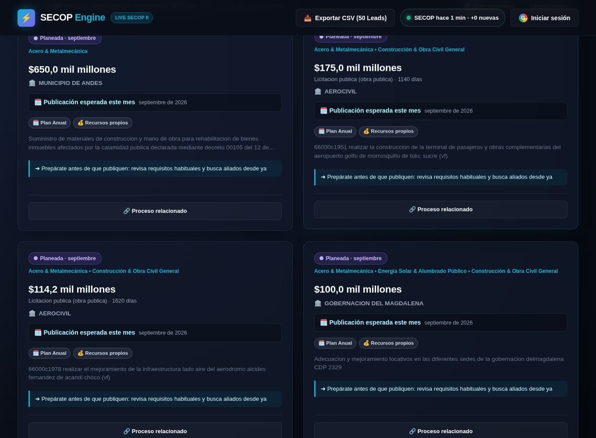
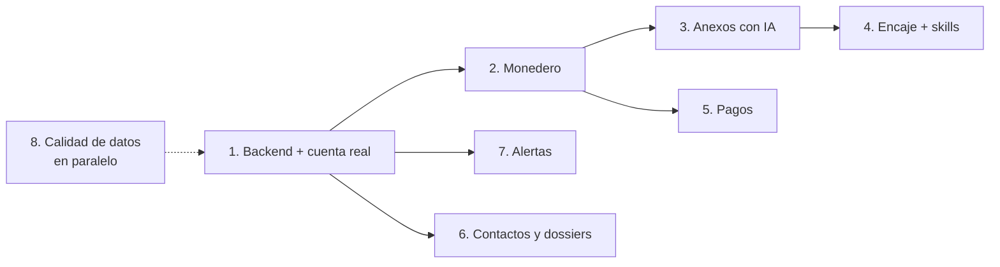

# Plan de iteraciones futuras

> **Para quién es este documento.** Para el dueño del producto (priorización y decisiones) y para el agente que implemente cada iteración. Cada iteración trae objetivo, alcance, criterios de aceptación, dependencias y riesgos.
> Diseño de detalle en [`CREDITOS_IA.md`](./CREDITOS_IA.md), [`PROPUESTA_FICHAS.md`](./PROPUESTA_FICHAS.md) y [`DISENO_PERFILES.md`](./DISENO_PERFILES.md). Estado actual en [`HANDOFF.md`](./HANDOFF.md). Guion de la demo en [`GUION_DEMO.md`](./GUION_DEMO.md).

**Fecha:** 2026-09-28. **Tallas:** S ≈ 1–2 días · M ≈ 3–5 días · L ≈ 1–2 semanas (una persona con asistencia de IA).

---

## 0. Punto de partida (lo que ya está en la demo)

Sitio estático en GitHub Pages con sincronización diaria desde SECOP II. Incluye:
- **Perfiles:** onboarding de 4 pasos, Perfil de Oportunidades, login con Google (modo demo) y afinidad.
- **Fichas:** fechas, estado real, badges, próximo paso y detalle.
- **Cruce con contratos:** fechas de ejecución, representante legal, trayectoria y datos de la entidad.
- **Fuentes abiertas gratuitas:** ofertas (competencia), integrantes de consorcios, sanciones y compras planeadas (PAA).
- **Estado de la sincronización:** nuevas, salidas, historial y estado de cada fuente.

**Límites conocidos de la demo:**
- No hay backend. Perfiles y CRM viven en el navegador y el login de Google no se verifica en un servidor.
- La IA y los créditos no existen todavía.
- Los datos personales de contacto se omiten por completo.

---

## Iteración 1: Backend mínimo y cuenta real · **L**

**Objetivo:** que la cuenta con Google sea real y que el perfil acompañe al usuario en cualquier dispositivo.

**Alcance:**
- Supabase (decisión pendiente frente a Firebase): verificación del ID token de Google e inicio de sesión con ese token.
- Tablas `profiles` y `crm_items` por usuario, con migración automática de `localStorage` en el primer inicio de sesión.
- Configurar el `GOOGLE_CLIENT_ID` real (hoy en modo demo).
- Políticas de acceso por fila: cada usuario lee y escribe solo lo suyo.

**Criterios de aceptación:**
- Iniciar sesión en dos navegadores muestra el mismo perfil y el mismo CRM.
- Un token manipulado desde el navegador no da acceso.
- El sitio sigue funcionando sin sesión para todo lo público.

**Depende de:** decisión de backend. **Riesgos:** configuración de OAuth y orígenes autorizados.

---

## Iteración 2: Monedero de créditos (sin pagos) · **M**

**Objetivo:** tener la mecánica de créditos funcionando antes de cobrar.

**Alcance:**
- Ledger append-only (`credit_transactions`) con bono de bienvenida, reserva, cobro y reembolso, y claves de idempotencia.
- Saldo visible en el menú de cuenta; cotización previa ("esta acción cuesta N créditos").
- Límites diarios por cuenta y una sola bonificación por cuenta verificada.

**Criterios de aceptación:**
- Un trabajo fallido reembolsa automáticamente.
- Dos clics seguidos no cobran dos veces.
- El saldo siempre coincide con la suma del ledger.

**Depende de:** iteración 1 y decisión del valor del crédito y del bono (`CREDITOS_IA.md` §9).

---

## Iteración 3: Análisis de anexos con IA (piloto) · **L**

**Objetivo:** extraer de los anexos de SECOP lo que el contrato necesita, con evidencia por página.

**Alcance:**
1. **Validación previa (S):** comprobar que `url_descarga_documento` de `dmgg-8hin` descarga sin sesión ni captcha y con qué límites. Medir tokens por página en 10 pliegos reales.
2. Selección automática de documentos relevantes (estudios previos, pliego, anexo técnico, presupuesto, formatos).
3. Extracción con salida estructurada y citas: necesidades (ítems y cantidades), requisitos habilitantes, garantías, criterios de evaluación, cronograma y riesgos.
4. Caché compartida por proceso y hash de los archivos.
5. Evaluación con 10–20 pliegos anotados a mano (precisión de requisitos y cantidades) para elegir entre Claude Opus 5 y Sonnet 5.

**Criterios de aceptación:**
- 90% o más de precisión en requisitos habilitantes sobre el conjunto de evaluación.
- Cada dato con documento y página.
- Costo medido por análisis dentro del precio en créditos.

**Depende de:** iteración 2 y decisión del modelo. **Riesgos:** descargas bloqueadas, archivos de más de 32 MB (hay uno real de 51 MB), PDFs escaneados.

---

## Iteración 4: Encaje perfil ↔ contrato y skills de perfil · **M**

**Objetivo:** que el usuario vea qué le piden, qué cumple y qué le falta, y que su perfil tenga evidencia real.

**Alcance:**
- Skill `experiencia-rup`: agrupa los contratos del NIT por código UNSPSC y valor.
- Skill `perfil-empresa`: propuesta de valor con evidencia (contratos, sitio web). El usuario aprueba cada cambio.
- "Encaje" en la ficha y el detalle (✅ cumples, ⚠️ te falta, 🧩 aliados sugeridos a partir de ofertas y consorcios) y skill `pitch-oportunidad`.

**Criterios de aceptación:** ninguna afirmación del perfil sin evidencia; lo que no tiene evidencia se marca "por confirmar".

**Depende de:** iteración 3 (para el encaje). Las skills de perfil pueden ir antes.

---

## Iteración 5: Pagos · **M**

**Alcance:**
- Pasarela local (Wompi o Mercado Pago: PSE, tarjetas, Nequi), paquetes de recarga y webhooks idempotentes que acreditan créditos.
- Historial de compras y facturación electrónica.

**Depende de:** iteración 2 y decisión de pasarela. **Riesgos:** requisitos tributarios y de facturación.

---

## Iteración 6: Contactos y dossiers con cuenta · **M**

**Objetivo:** desbloquear con la cuenta (o con créditos) lo que hoy se omite por privacidad.

**Alcance:**
- Dossier de aliado o competidor: historial, consorcios, ofertas, sanciones y resumen redactado por IA.
- Contactos institucionales de la entidad (PAA) y de grupos (`ceth-n4bn`), servidos desde el backend y solo a usuarios con cuenta, con nota legal, finalidad y registro de consultas.
- Bloqueo "duro" del Perfil de Oportunidades (hoy es solo visual; ver `DISENO_PERFILES.md` §8).

**Depende de:** iteración 1 y **revisión legal** (Ley 1581 de 2012).

---

## Iteración 7: Alertas · **M**

**Alcance:**
- Correo o WhatsApp diario después de la sincronización (6:00 a. m.) con nuevas oportunidades afines, cierres próximos y compras planeadas del sector.
- Configuración por perfil (palabras clave de `analysis.alertKeywords`, zonas, ticket).

**Criterios de aceptación:** una alerta por usuario y día como máximo, con enlace directo a la ficha, y la opción de darse de baja.

**Depende de:** iteración 1.

---

## Iteración 8: Calidad y volumen de datos (en paralelo, sin backend) · **S–M**

Estas mejoras se pueden hacer en cualquier momento:

| Tarea | Talla | Detalle |
|---|---|---|
| Falsos positivos de taxonomía | S | **Hecho (2026-09-30, rama `pro/foundation`):** PAE es sector propio y HORECA solo equipos de cocina; exclusiones por palabra (`excluir_si`) y por tipo de contrato (`excluir_tipos_contrato`) con pruebas, tras leer 20 procesos por sector. Pendiente: revisar "vigas" |
| Leads adjudicados recientes | S | **Hecho (2026-09-30):** la consulta vieja filtraba por estados que no existen en SECOP II y no devolvía nada. `src/harvest.py` usa `adjudicado = 'Si'` y una consulta de adjudicados de los últimos 14 días |
| Más volumen | M | **Hecho (2026-09-30):** el tablero pasa de 150 a 500 con mínimo de 20 por sector. En la corrida de prueba `web/data.js` pesó 2,24 MB (antes 0,61 MB) y la corrida tardó 449 s |
| Sectores nuevos | S | **Hecho (2026-09-30):** 12 sectores en 3 familias, "Otros" (sin sector y seguros) en el filtro, convenios con entidades sin ánimo de lucro marcados. Muestra en `docs/DESCUBRIMIENTO_SECTORES_2026-09-30.md` |
| Peso del repositorio | S | **Más urgente desde el 2026-09-30:** con 500 registros `web/data.js` pesa 2,24 MB y `web/hidden.js` 1,32 MB, y ambos se versionan a diario. Publicar GitHub Pages desde un artefacto del workflow evitaría esos commits |
| Proveedores registrados | S | El diagnóstico no encontró el dataset de "proveedores registrados" de SECOP II; buscarlo con `probe_sources` ampliando las búsquedas |
| Cobertura de sanciones | S | `4n4q-k399` es SECOP I; buscar un equivalente de SECOP II o de la Procuraduría/Contraloría con datos abiertos |
| PAA más preciso | S | Hoy se filtra por prefijos UNSPSC de los sectores; agregar palabras clave del sector sobre la descripción para descartar ruido |
| Analítica del embudo | S | Medir inicio y fin del onboarding, registro y activación (`DISENO_PERFILES.md` §11) |

---

## Iteración 9: Experiencia del tablero y persona natural (sin backend) · **M**

Pedido del dueño del 2026-10-01. Ya está hecho:
- la mínima cuantía entra al tablero (`eb3ee21`, PR #3);
- filtros por modalidad y por fecha del estado actual (`96e86ee`, PR #3);
- 9.0, GitHub Actions v7 (`27d6512`, PR #4);
- 9.3, persona natural (`20511d9`, `46be449` y `f19a36f`, rama `pro/persona-natural`).

Lo que sigue, en este orden:

| # | Tarea | Talla | Detalle |
|---|---|---|---|
| 9.0 | ~~Actualizar las GitHub Actions~~ | S | **Hecho (2026-10-01, PR #4):** las cuatro acciones pasan a v7 (Node 24). Una prueba impide volver a versiones de Node 20. Python 3.11 y 3.14 tienen binarios para Ubuntu 26.04. |
| 9.1 | Umbral propio para la mínima cuantía | S | Hoy la mínima cuantía solo entra si vale 50 M o más (`MIN_PRICE`). En SECOP II, del 2026-09-17 al 2026-10-01, se publicaron (sin prestación de servicios): 208 por debajo de 10 M, 202 entre 10 y 20 M, 469 entre 20 y 50 M, y 209 de 50 M o más. Un umbral menor solo para esta modalidad (consulta general aparte) sube el volumen y la duración de la corrida. Medir con `--out` y decidir con el dueño. Si agrega un descarte, sumarlo al embudo. |
| 9.2 | Selector de tema: sistema, claro, oscuro y Matrix | M | (1) Pasar a tokens las 122 constantes de color de `style.css` que hoy están fuera de `:root`; el tema oscuro actual queda como los tokens por defecto. (2) Agregar `:root[data-theme="light"]` y `[data-theme="matrix"]` (fondo negro, verde fósforo, fuente monoespaciada del sistema, sin animación). (3) Crear `web/theme.js` en el `<head>`, antes del CSS para evitar el parpadeo; usa `localStorage.secop_theme` y `prefers-color-scheme`. (4) Un `<select>` en la barra superior. (5) Una prueba de humo por tema. (6) Agregar `secop_theme` a la tabla de `AGENTS.md`. |
| 9.3 | ~~Persona natural~~ | M | **Hecho (2026-10-01):** la consulta se restringe a obra, suministros, compraventa, interventoría y consultoría, de 50 M o más ("Otro" y "Decreto 092" quedan fuera). El umbral es 12 %, elegido por el dueño viendo la tabla calculada. La web agrupa las modalidades como el filtro, así que "Régimen especial", con y sin ofertas, queda en 11,8 % y no se marca. No se marca lo adjudicado, porque ya no admite proponentes; el detalle sí muestra la cifra. En la corrida de prueba se marcaron 48 de 274 procesos del Observatorio y 5 de 80 del PAA. Diseño original: (1) Nueva fuente `perfil_proponente` en `open_sources.py`: una consulta agregada a `jbjy-vk9h` (modalidad × `tipodocproveedor`, últimos 12 meses), restringida a contratos parecidos al tablero (valor ≥ umbral, sin tipos de OPS; confirmar los valores con `probe_sources --valores`). Se publica en `meta.perfil_proponente` y se valida en `schema.py`. (2) Badge 👤 "Persona natural gana N%" cuando la modalidad supera un umbral de producto; proponer 20 % tras ver la tabla calculada y confirmarlo con el dueño. (3) Una opción en el filtro de modalidad: "Más accesibles a persona natural". (4) Una línea en el detalle. Es una observación del mercado, no un requisito legal: el pliego manda (RUP, experiencia). |
| 9.4 | Fichas y detalle del PAA y de "Fuera del tablero" como las del Observatorio | M | **Pipeline:** `light_record` agrega `fechas`, `fecha_adjudicacion`, `plazo`, `competencia`, `nit_entidad`, `fase` y `contratista`; medir cuánto crece `hidden.js`. `fetch_paa` agrega el mes esperado de inicio, el valor de la vigencia actual, las vigencias futuras y su estado, la fecha de la versión y el grupo de procedimiento; **nunca** los contactos personales. **Web:** un solo constructor de ficha para las tres vistas. El detalle de lo oculto reutiliza `openDetailModal` y agrega una sección con el motivo. El detalle del PAA es nuevo: planeación, códigos UNSPSC, estadísticas de la entidad y "procesos de esta entidad en el tablero" (cruce por `nit_entidad`). Con `fecha_adjudicacion`, el filtro de tiempo deja de excluir los adjudicados de "Fuera del tablero". |
| 9.5 | Más datos visibles sin perder rendimiento | M | **Medido el 2026-10-01** sobre la corrida publicada `f0a549e`: 7125 descargados, 3284 clasificados, 500 en el tablero (15 %), 2333 fuera del corte, 898 sin sector y 745 convenios. `data.js` pesa 2.192.037 B (4,4 KB por registro; 284.702 B en gzip; 38 ms de carga en Node). `hidden.js` pesa 1.297.446 B (1500 registros; 188.275 B en gzip; 22 ms). Los sectores pequeños (Vehículos, Eventos y Acero con 21; HORECA y Salud con 22; Dotación con 26) agotan su oferta: subir de 500 agregaría sobre todo Obra civil, PAE, Agua e Interventoría. **Propuesta, en orden:** (1) Pintar las fichas en páginas (unas 60, con "ver más"); hoy `app.js` pinta todas. (2) Publicar en `hidden.js` toda la lista fuera del tablero (3976, sin el tope `HIDDEN_WEB_MAX = 1500`). Proporcionalmente serían unos 0,5 MB en gzip `[POR VERIFICAR con una corrida]`, y la lista solo se descarga al abrir la vista. Conviene después de 9.4. (3) Dejar de versionar los datos (GitHub Pages desde un artefacto del workflow; fila "Peso del repositorio" de la iteración 8). (4) Solo entonces, probar un tablero de 800 a 1000 registros completos, midiendo la duración de la corrida (hoy 380 s) y el peso. |

**Por qué persona natural apunta a la mínima cuantía y no a la menor cuantía.** La tabla viene de una consulta de solo lectura del 2026-10-01 a SECOP II Contratos (`jbjy-vk9h`). Cuenta los contratos firmados desde el 2026-01-01, sin "Prestación de servicios", y el porcentaje que ganó un proponente con cédula de ciudadanía:

| Modalidad | Contratos | % con cédula |
|---|---:|---:|
| Mínima cuantía | 35.271 | 25,3 |
| Selección abreviada subasta inversa | 4.623 | 13,2 |
| Selección abreviada de menor cuantía | 6.481 | 9,2 |
| Contratación régimen especial (con ofertas) | 6.658 | 9,2 |
| Concurso de méritos abierto | 1.421 | 7,9 |
| Licitación pública Obra Pública | 836 | 3,0 |
| Licitación pública | 1.292 | 2,4 |

La "Contratación régimen especial" sin ofertas (84,4 %) y la "Contratación directa" (96,2 %) están dominadas por contratos con personas. Por eso la cifra que publique el pipeline debe restringirse a contratos parecidos a los del tablero. Estas cifras son contexto de diseño: en la web solo se muestran las que calcule el pipeline.

---

## Orden recomendado

1. **Ahora, sin decisiones pendientes:** iteración 9 (empezando por 9.0, que tiene fecha límite) e iteración 8, que mejoran la demo con poco riesgo.
2. **Tras decidir el backend:** iteraciones 1 → 2 → 3, que forman el camino al "wow" pagado.
3. **En paralelo, cuando haya usuarios:** iteraciones 7 (retención) y 5 (ingresos).
4. **Cuando haya revisión legal:** iteración 6.

## Decisiones pendientes que bloquean iteraciones

| Decisión | Bloquea | Referencia |
|---|---|---|
| Backend (Supabase o Firebase) | 1, 2, 6, 7 | `CREDITOS_IA.md` §9.1 |
| Valor del crédito y bono de bienvenida | 2 | §9.3 |
| Modelo de IA (Opus 5 o Sonnet 5; ¿DeepSeek?) | 3 | §9.2 |
| Pasarela de pagos | 5 | §9.4 |
| Contactos personales y revisión legal | 6 | §9.5 |
| `GOOGLE_CLIENT_ID` real | 1 | `HANDOFF.md` |
