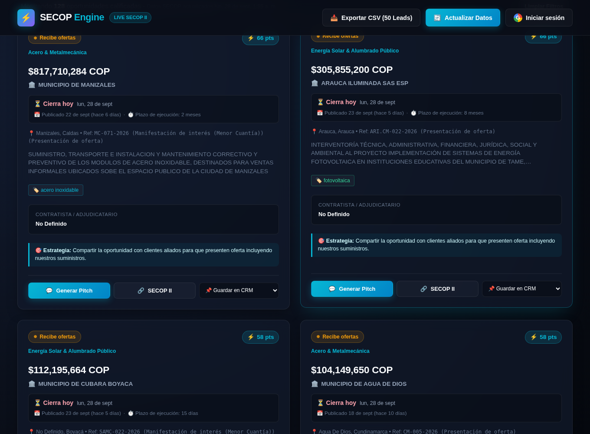
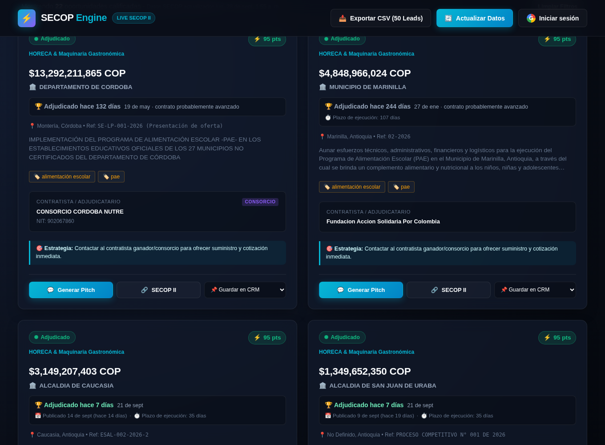
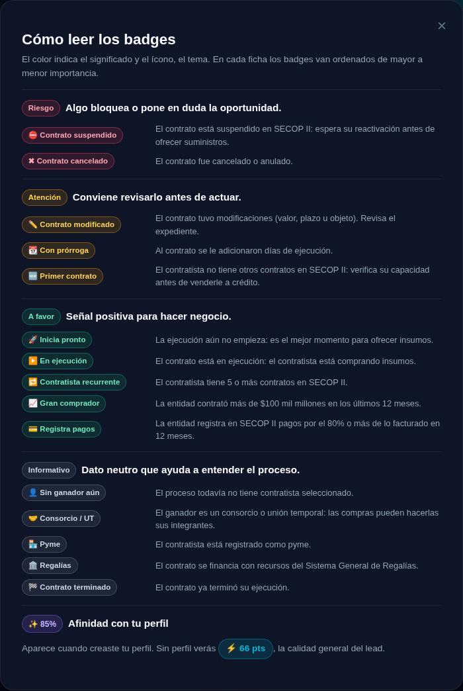
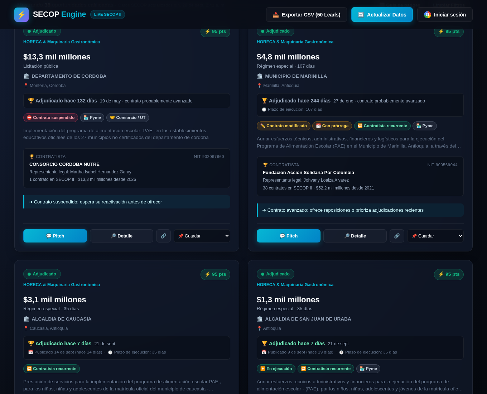
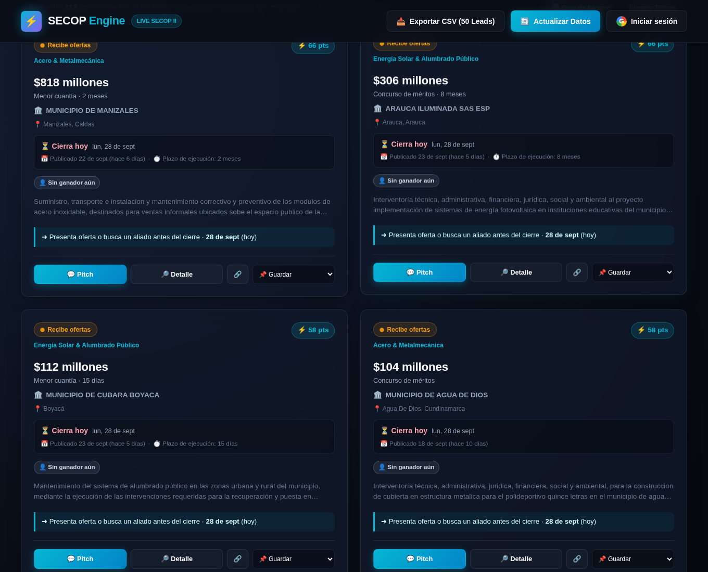
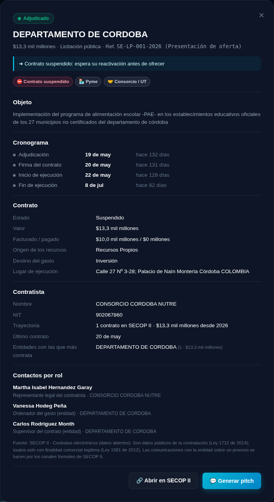
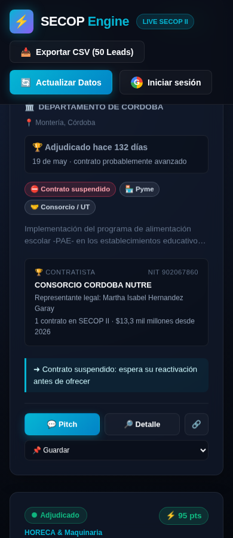

# Propuesta: fichas de oportunidad (fechas, qué mostrar y cruces con otras fuentes)

> **Para quién es este documento.** Para quien revisa el diseño (*human in the loop*) y para el agente que implemente las siguientes fases. Separa lo que **ya está implementado** (§1) de lo que es **hipótesis por validar** (§2–§6).
> Contexto general en [`HANDOFF.md`](./HANDOFF.md) y [`DISENO_PERFILES.md`](./DISENO_PERFILES.md).

**Origen:** los usuarios pidieron que las fechas relevantes sean visibles en las fichas. Se aprovechó para revisar toda la información de la ficha y para hipotetizar con qué otras fuentes públicas cruzarla: datos de contratistas, tomadores de decisión y contactos clave.

---

## 1. Implementado: fechas visibles en la ficha

### 1.1 Qué se ve ahora

| Observatorio ordenado por cierre más próximo | Radar B2B (adjudicados) |
|---|---|
|  |  |

Cada ficha tiene un **bloque de fechas** debajo de la entidad, con lo más accionable primero:

| Estado real del proceso | Línea principal | Línea secundaria |
|---|---|---|
| **Recibe ofertas**, con fecha de cierre | "⏳ Cierra en 5 días · vie, 3 oct, 5:00 p. m.", en ámbar si faltan menos de 7 días y en rojo si faltan menos de 3 | Publicado · plazo de ejecución |
| Recibe ofertas, sin fecha de cierre | "⏳ Cierre de ofertas: consúltalo en el pliego" | Publicado · plazo |
| **Borrador** | "📝 Borrador: aún puedes presentar observaciones" | Plazo, si existe |
| **Ofertas cerradas** (evaluación o selección, o cierre vencido) | "🔒 Ya no recibe ofertas · cerró el …" | Publicado · plazo |
| **Adjudicado** | "🏆 Adjudicado hace 3 días · 25 sep". Si pasaron más de 90 días, en gris: "contrato probablemente avanzado" | Publicado · plazo de ejecución |

Además:
- **Orden por fecha:** hay un selector para ordenar por cierre más próximo, más recientes o mayor valor.
- **Frescura de los datos:** la cabecera de resultados dice cuándo se actualizaron los datos de SECOP ("Datos SECOP actualizados …").
- **Pitch:** el mensaje para licitaciones abiertas incluye la fecha de cierre.

### 1.2 Corrección de fondo: "abierta" ahora significa abierta

Antes, todo lo que no estaba adjudicado se presentaba como "Licitación abierta" y contaba como "Aún abiertos: llegas a tiempo". En el dataset del 27-sep eso incluía **26 procesos en Evaluación y 14 en Seleccionado**, que ya no reciben ofertas.

La función `bidWindow` (en `web/profile-engine.js`) decide el estado real:
1. Adjudicado.
2. Si hay fecha de cierre: abierta si es futura, cerrada si ya pasó.
3. Si no hay fecha: cerrada si el estado de SECOP es Evaluación, Seleccionado, Aprobado o Suspendido.
4. En otro caso: borrador o abierta, según la etapa.

La misma lógica alimenta:
- la etiqueta de estado de la ficha;
- el conteo "Aún abiertos" del Perfil de Oportunidades;
- el modelo de afinidad: un proceso cerrado solo suma 2 puntos por etapa y nunca muestra la razón "llegas a tiempo".

### 1.3 Datos nuevos que extrae el pipeline

`ScopeExtractor.enrich` ahora agrega a cada oportunidad:

```json
"fechas": { "publicacion", "ultima_actualizacion", "cierre_ofertas", "apertura_ofertas", "adjudicacion" },
"plazo": { "valor": 6, "unidad": "meses", "texto": "6 meses" },
"competencia": { "interesados": 12, "ofertas": 3, "visualizaciones": 240 }
```

- Los nombres de columna de SECOP se buscan con varias variantes y, si ninguna coincide, por prefijo. Las fechas centinela (años anteriores a 2000) se descartan.
- El pipeline imprime en el log **cuántas oportunidades traen cada campo**, además de las columnas de fecha que encontró en SECOP. Si una columna cambia de nombre, se nota en la siguiente corrida diaria.
- `competencia` se extrae pero **no se muestra**. En los datos reales, "interesados" es 0 en todos los procesos y "ofertas" solo tiene datos en 33 (ver §7).
- SECOP publica el cierre **sin hora**, así que el proceso se considera abierto hasta el final de ese día. El plazo se normaliza de "107 día(s)" a "107 días".

**Cobertura real (corrida del pipeline sobre esta rama):** ver §7.

---

## 2. Diagnóstico de la ficha actual

Medido sobre las 150 fichas del dataset del 27-sep-2026:

| Elemento | Problema observado | Evidencia |
|---|---|---|
| Recuadro "Contratista / Adjudicatario" | Vacío en procesos no adjudicados | **121 de 128** fichas no adjudicadas muestran "No Definido" |
| Banner "🎯 Estrategia" | Texto genérico que se repite | Solo **4 textos distintos** en 150 fichas; el usuario deja de leerlo |
| Etiquetas de materiales (🏷️) | Duplican la información del sector | En **150 de 150** son exactamente las palabras clave del sector |
| Descripción | Difícil de leer | **122 de 150** están en MAYÚSCULAS; mediana de 221 caracteres |
| Dos puntajes ("⚡ 66 pts" y "✨ 85%") | Confunden: ¿cuál importa? | El puntaje de calidad no depende del usuario; la afinidad sí |
| Valor "$435,050,000 COP" | Lectura lenta; inconsistente con el resto de la app | El perfil y el banner usan "$435 millones" |
| Referencia del proceso (`Ref: 4100002208`) | Código técnico en la vista principal | Útil solo para buscar en SECOP |
| NIT del contratista | Falta en la mitad de los adjudicados | Solo **11 de 22** lo traen |
| **Fechas** | No había ninguna | ✅ Resuelto en §1 |

---

## 3. Hipótesis: qué debería mostrar la ficha

**Principio.** La ficha debe responder cuatro preguntas en cinco segundos, en este orden:
1. **¿Qué es y cuánto vale?**
2. **¿Me sirve?**
3. **¿Cuándo tengo que actuar?**
4. **¿Qué hago y con quién hablo?**

Todo lo que no responda una de esas preguntas pasa a la vista de detalle.

**Consecuencia: la ficha debe cambiar según la etapa.** A un proveedor frente a un proceso adjudicado le importa *a quién venderle y cuándo empieza la obra*. A un contratista frente a una licitación abierta le importa *cuándo cierra, cuánta competencia hay y qué le exigen*.

### 3.1 Ficha para procesos abiertos o en borrador

```
┌─────────────────────────────────────────────────────────┐
│ ● Recibe ofertas     Acero & Metalmecánica     ✨ 85%   │
│ $435 millones · Licitación pública · 6 meses            │
│ 🏛️ EMPRESAS PÚBLICAS DE MEDELLÍN · Medellín, Antioquia   │
│ ┌─────────────────────────────────────────────────────┐ │
│ │ ⏳ Cierra en 5 días · vie 3 oct, 5:00 p. m.          │ │
│ │ 👀 18 visualizaciones · 3 ofertas recibidas         │ │  ← competencia (ver §7)
│ └─────────────────────────────────────────────────────┘ │
│ Suministro de varilla de acero recubierta en cobre…     │  ← en minúsculas, 2 líneas
│ Por qué te sirve: sector · en tu zona · en tu ticket    │  ← razones de afinidad
│ ➜ Próximo paso: presenta tu oferta o busca un aliado    │  ← acción según la fecha
│   antes del 3 oct                                       │
│ [💬 Pitch]  [🔗 SECOP]  [📌 Guardar]                    │
└─────────────────────────────────────────────────────────┘
```

### 3.2 Ficha para procesos adjudicados (proveedores B2B)

```
┌─────────────────────────────────────────────────────────┐
│ ● Adjudicado hace 3 días     HORECA            ✨ 80%   │
│ $13.292 millones · Suministros · 10 meses               │
│ 🏛️ DEPARTAMENTO DE CÓRDOBA · Montería                    │
│ 🏆 CONSORCIO CÓRDOBA NUTRE · NIT 902067860              │
│    Rep. legal: [nombre] · 14 contratos previos ($48 mil M)│  ← cruce §4
│ ⏱️ Ejecución: oct 2026 → jul 2027 (compra de insumos     │  ← fechas del contrato (§4)
│    probable en las primeras semanas)                    │
│ ➜ Próximo paso: contacta a compras antes del inicio     │
│ [💬 Pitch]  [🔗 SECOP]  [📌 Guardar]                    │
└─────────────────────────────────────────────────────────┘
```

### 3.3 Mostrar, simplificar y ocultar

| Acción | Elemento | Por qué |
|---|---|---|
| ➕ Mostrar | **Fechas** (cierre, adjudicación, publicación, plazo) | ✅ Hecho. Es el pedido principal de los usuarios |
| ➕ Mostrar | **Modalidad** en lenguaje simple ("Licitación pública", "Menor cuantía") | Define requisitos y competencia; hoy no aparece |
| ➕ Mostrar | **Competencia:** ofertas recibidas y visualizaciones | Ya se extrae (§1.3), pero la cobertura es baja (§7). La fuente confiable son los proponentes por proceso (§4, cruce 4) |
| ➕ Mostrar | **Inicio y fin de ejecución** en adjudicados | Es cuando el contratista compra insumos: el momento de venderle |
| ➕ Mostrar | **Próximo paso con fecha** en lugar del banner genérico | Reemplaza 4 textos repetidos por una acción concreta |
| ➕ Mostrar | **Razones de afinidad** en todas las pestañas (hoy solo en "Para Ti") | Explica el porqué, en una línea |
| ✂️ Simplificar | Valor en formato corto ("$435 millones") | Consistente con el perfil; se lee más rápido |
| ✂️ Simplificar | Descripción en minúsculas y limitada a 2 líneas | 122 de 150 están en mayúsculas |
| ✂️ Simplificar | Un solo puntaje: afinidad si hay perfil, calidad si no | Evita la duda sobre cuál puntaje importa |
| 🙈 Ocultar | Recuadro de contratista cuando no hay ganador | Vacío en 121 de 128 fichas |
| 🙈 Ocultar | Etiquetas de materiales que repiten el sector | Duplicadas en 150 de 150 |
| 📄 Mover a detalle | Referencia, estado SECOP literal, NIT de la entidad, descripción completa | Útiles para verificar, no para decidir |

Para esto hace falta una **vista de detalle** (hoy solo existe el modal del pitch). Ahí iría el cronograma completo del proceso, la descripción completa, el historial del contratista y la ficha de la entidad.

---

## 4. Hipótesis: cruces con otras fuentes públicas

El pipeline solo usa hoy el dataset de **procesos** de SECOP II (`p6dx-8zbt`). Los cruces de mayor valor, en orden:

| # | Fuente | Qué aporta a la ficha | Llave de cruce | Esfuerzo |
|---|---|---|---|---|
| 1 | **SECOP II · Contratos electrónicos** (`jbjy-vk9h`, ya declarado en `socrata_client.py`) | Fecha de firma, **inicio y fin de ejecución**, valor final; **ordenador del gasto** y **supervisor** (entidad); **representante legal** del contratista; si es pyme | ID del portafolio / proceso de compra ↔ `id_del_portafolio` (por verificar) | Bajo: mismo cliente, mismo formato |
| 2 | **Historial del contratista** (el mismo dataset de contratos, filtrado por NIT del proveedor) | N.º de contratos, valor total, entidades clientes recurrentes, sectores donde gana | NIT | Bajo |
| 3 | **SECOP II · Proveedores registrados** (ID por verificar) | Datos de contacto **empresariales** registrados por el proveedor en SECOP: correo, teléfono, dirección; tamaño | NIT | Bajo–medio |
| 4 | **SECOP II · Proponentes por proceso** (ID por verificar) | Quién se presentó a cada proceso: competencia real y posibles **aliados de consorcio** (empresas que compiten en el mismo sector) | ID del proceso | Medio |
| 5 | **Plan Anual de Adquisiciones (PAA)** de las entidades (ID por verificar) | Compras **planeadas** antes de que exista el borrador: la señal más temprana posible | Entidad + código UNSPSC | Medio |
| 6 | **RUES / Cámaras de comercio** (registro mercantil) | Estado de la matrícula (activa o cancelada), antigüedad, actividad económica (CIIU), domicilio | NIT | Medio: no hay API abierta estable; puede requerir un convenio o un proveedor de datos |
| 7 | **Multas y sanciones** en SECOP; boletín de responsables fiscales (Contraloría); antecedentes (Procuraduría) | **Señales de riesgo** antes de aliarse con alguien o venderle a crédito | NIT / cédula | Medio–alto: consulta uno a uno; no hay descarga masiva |
| 8 | **Estados financieros** de Supersociedades (datos abiertos) | Ingresos y patrimonio: capacidad real de pago o de ejecución del contratista | NIT | Medio; solo cubre sociedades vigiladas |
| 9 | **SIGEP** (directorio de servidores públicos) | Cargo y dependencia de funcionarios de la entidad | Nombre + entidad | Alto y sensible (ver §5) |

**Primer paso recomendado.** Implementar los cruces 1 y 2. Se hacen con el mismo cliente Socrata, sin fuentes nuevas, y habilitan tres cosas:
- las fechas de ejecución, que responden la pregunta clave del proveedor: *¿cuándo compra el contratista?*;
- el representante legal del ganador;
- el historial del contratista, que da contexto: "14 contratos previos por $48 mil millones".

Antes de implementarlos hay que confirmar la llave de cruce entre procesos y contratos con datos reales.

---

## 5. Tomadores de decisión y contactos clave

### 5.1 Quién decide, según la etapa

| Momento | Con quién conectar | Dato público disponible | Canal adecuado |
|---|---|---|---|
| **Borrador u ofertas abiertas** | La entidad contratante | Unidad de contratación, en el proceso; ordenador del gasto, en contratos previos de la entidad | **Solo los canales formales del proceso en SECOP II** (observaciones y preguntas). No se debe contactar a funcionarios por fuera del proceso (ver §5.3) |
| Borrador u ofertas abiertas | **Otros oferentes o aliados** | Proponentes de procesos similares (cruce 4) y ganadores recientes | Contacto comercial directo entre empresas |
| **Adjudicado** | **Contratista ganador**: representante legal, compras, dirección de obra | Representante legal (contratos, cruce 1); datos de contacto empresariales (cruce 3) | Contacto comercial directo. Es el caso de uso principal del Radar B2B |
| Adjudicado, consorcio | Representante del consorcio y **empresas integrantes** | Nombre del consorcio; integrantes (por verificar en qué dataset están) | Contacto con cada integrante; suele ser quien compra |
| Ejecución | Supervisor o interventor (entidad) | Supervisor, en contratos | Solo informativo; no es un comprador |

### 5.2 Cómo presentarlo en la ficha

- Mostrar **rol y organización antes que la persona**: "Representante legal de CONSORCIO X", con la persona como dato secundario.
- Priorizar **canales institucionales o empresariales** (correo y teléfono registrados por la empresa en SECOP o en el registro mercantil) sobre datos personales.
- Mostrar siempre la **fuente y la fecha** del dato: "Fuente: SECOP II · Contratos, 25 sep 2026".
- Los datos de contacto encajan con el desbloqueo del registro: hoy el perfil difumina nombres; los contactos serían el incentivo "duro" para crear la cuenta (ver `DISENO_PERFILES.md` §8, pregunta 1).

### 5.3 Límites legales y éticos (a validar con asesoría jurídica)

- **Transparencia (Ley 1712 de 2014):** la información de contratación pública es pública por regla general. Eso incluye quién contrata, con quién y por cuánto.
- **Datos personales (Ley 1581 de 2012):** que un nombre sea público no autoriza cualquier uso. Aplican los principios de finalidad y circulación restringida. Recomendación: no enriquecer personas con datos personales (celular o correo personal) obtenidos de otras fuentes, como redes sociales o *scraping*; no crear perfiles de funcionarios; y ofrecer un mecanismo de exclusión.
- **Transparencia del proceso de contratación:** mientras un proceso está abierto, la interacción con la entidad debe hacerse por los canales formales del proceso. La herramienta no debe sugerir contactar al ordenador del gasto para "conectar con la oportunidad". En esa etapa, el valor está en conectar con **aliados y oferentes**, no con funcionarios.
- **Términos de uso de las fuentes:** RUES, Procuraduría y Contraloría tienen condiciones de consulta propias; hay que revisarlas antes de automatizar.

---

## 6. Plan por fases

| Fase | Contenido | Estado |
|---|---|---|
| 0 | Fechas en la ficha, estado real (abierta o cerrada), orden por fecha, frescura de datos | ✅ Implementado |
| 1 | Rediseño de la ficha según §3.3: un solo puntaje, sin elementos vacíos o duplicados, próximo paso con fecha, badges | ✅ Implementado (§9). La competencia queda fuera por falta de datos confiables (§7) |
| 2 | Cruce con contratos (fechas de ejecución, representante legal) e historial del contratista | ✅ Implementado (§9) |
| 3 | Vista de detalle del proceso, con el cronograma completo y el contexto de la entidad y del contratista | ✅ Implementado (§9) |
| 4 | Contactos empresariales (proveedores registrados), proponentes por proceso, PAA | Propuesto: requiere backend para desbloquear por cuenta |
| 5 | Señales de riesgo (sanciones, registro mercantil, estados financieros) | Propuesto: validar fuentes y términos |

## 7. Evidencia: cobertura de campos en SECOP

Corrida del pipeline en GitHub Actions (run `36367795452`, 28-sep-2026, 150 oportunidades):

| Campo | Oportunidades con dato | Lectura |
|---|---|---|
| `fechas.publicacion` | 98 | Falta en 22 de 23 borradores (esperado: aún no se publican) |
| `fechas.cierre_ofertas` | 81 | Sin hora. Nunca es anterior a la publicación |
| `fechas.apertura_ofertas` | 96 | Igual al cierre en 70 casos: aporta poco |
| `fechas.adjudicacion` | 22 | Todos los adjudicados |
| `fechas.ultima_actualizacion` | 98 | — |
| `plazo` | 122 | Unidades: 54 en días, 65 en meses, 3 en años |
| `competencia.interesados` | 150, pero **todos en 0** | No sirve |
| `competencia.ofertas` | 33 con valor > 0 | Casi solo en procesos ya seleccionados |
| `competencia.visualizaciones` | 84 con valor > 0 | Señal débil de interés |

**Hallazgos que salen de las fechas:**
- De los 128 procesos no adjudicados que antes se presentaban como "abiertos", **44 ya no reciben ofertas**: están en evaluación o selección, o su cierre ya venció. Hoy 61 reciben ofertas y 23 están en borrador.
- **12 de los 22 adjudicados tienen más de 90 días** (el más viejo, 333 días). Como "lead B2B de venta directa" probablemente llegan tarde: el contratista ya compró. El pipeline debería priorizar adjudicaciones recientes.
- Varios procesos cierran **el mismo día** en que se consultan. Una alerta diaria temprana (6:00 a. m., cuando corre el pipeline) tendría valor inmediato.

## 8. Preguntas para el revisor

> Resueltas por el dueño (2026-09-28): primero el cruce, luego el rediseño; usar badges con una convención clara; aplicar las sugerencias de mostrar u ocultar.

1. ¿Priorizamos el **rediseño de la ficha** (fase 1) o el **cruce con contratos** (fase 2)? La fase 2 alimenta a la 1.
2. ¿Aceptamos mostrar **nombres de personas** (representante legal) en la ficha, o solo empresas y roles?
3. ¿Los **contactos** deben ser la recompensa del registro (bloqueo duro)? Eso exige backend para que el bloqueo sea real.
4. ¿Qué umbral de urgencia prefieren los usuarios (hoy: ámbar a menos de 7 días y rojo a menos de 3)?
5. ¿Hay presupuesto para una fuente de datos de empresas (RUES u otro proveedor) si las fuentes abiertas no alcanzan?

---

## 9. Implementado: cruce con SECOP II Contratos y rediseño de la ficha

### 9.1 Cruce con contratos (`src/enrichers/contract_enricher.py`)

**Llave de cruce confirmada con datos reales:** `contratos.proceso_de_compra` = `procesos.id_del_portafolio` (se guarda como `id_portafolio`). Se hacen 5 consultas por lotes de 40 identificadores. Cualquier fallo se registra en el log y el refresco diario continúa sin el cruce.

| Bloque | Contenido | Uso en la app |
|---|---|---|
| `contrato` | Estado; fechas de firma, inicio y fin de ejecución; valor, facturado y pagado; días adicionados; prórroga; origen de los recursos; destino del gasto; **lugar de ejecución**; condiciones de entrega; pyme o grupo; lotes | Badges, próximo paso, cronograma y detalle |
| `contrato.contactos` | Representante legal del contratista; ordenador del gasto, supervisor y ordenador de pago de la entidad | Ficha (representante legal) y detalle (todos, por rol) |
| `historial_contratista` | Contratos en SECOP II, valor total, primer y último contrato, 3 entidades con las que más contrata | "Contratista recurrente" / "Primer contrato" y trayectoria |
| `entidad_stats` | Contratos y valor en 12 meses, % pagado sobre lo facturado, 3 principales contratistas de obra y suministro | "Gran comprador", "Registra pagos" y detalle |

**Qué no se guarda (privacidad):** números de documento, datos bancarios (banco, tipo y número de cuenta), género, domicilio ni nacionalidad del representante legal. Tampoco los "principales contratistas" de tipo prestación de servicios, que suelen ser personas naturales, ni los créditos bancarios. Hay pruebas que verifican que esos datos no se filtran.

**Procesos con contrato firmado → adjudicados.** Si un proceso tiene un contrato válido (no en borrador, cancelado ni anulado), pasa a "Adjudicado (Contrato firmado)" aunque SECOP lo muestre en *Seleccionado* o *Evaluación*. Se completan el contratista y la fecha de adjudicación (fecha de firma). En la corrida real, **17 procesos** pasaron a adjudicados: el Radar B2B pasó de **22 a 39 leads**.

**Cobertura real** (run del 28-sep-2026, 150 oportunidades):

| Dato | Cobertura |
|---|---|
| Oportunidades con contrato | 37 (18 de los 22 adjudicados originales + 19 con contrato firmado) |
| Fecha de firma / fin de ejecución | 35 / 35 |
| Inicio de ejecución | 24 (el dataset no trae la columna `fecha_de_inicio_de_ejecucion`; se usa `fecha_de_inicio_del_contrato`) |
| Representante legal / ordenador del gasto / supervisor | 35 / 23 / 21 |
| Facturado / pagado | 12 / 5: los pagos casi no se registran |
| Anticipo | 0: no se usa |
| Historial del contratista | 36 |
| Estadísticas de la entidad | 113 |

**Advertencia sobre pagos.** El "% pagado sobre lo facturado" de una entidad refleja también pagos **no registrados** en SECOP (una gobernación aparece con 4%). Por eso solo existe el badge positivo "Registra pagos" (80% o más) y no uno negativo; en el detalle se muestra con esa aclaración.

### 9.2 Convención de badges

**El color es el significado; el ícono es el tema.** Los badges se ordenan por importancia (riesgo primero). La ficha muestra hasta 4 y un "+N"; el detalle los muestra todos. La lógica vive en `ProfileEngine.cardBadges` (con pruebas) y la guía se abre con "ℹ️ Guía de badges", generada desde el mismo catálogo (`ProfileEngine.BADGES`).

| Tono | Significado | Badges |
|---|---|---|
| 🔴 Riesgo | Algo bloquea o pone en duda la oportunidad | ⛔ Contrato suspendido · ✖ Contrato cancelado |
| 🟠 Atención | Conviene revisarlo antes de actuar | ✏️ Contrato modificado · 📆 Con prórroga · 🆕 Primer contrato |
| 🟢 A favor | Señal positiva para hacer negocio | 🚀 Inicia pronto · ▶️ En ejecución · 🔁 Contratista recurrente · 📈 Gran comprador · 💳 Registra pagos |
| ⚪ Informativo | Dato neutro | 👤 Sin ganador aún · 🤝 Consorcio / UT · 🏪 Pyme · 🏛️ Regalías · 🏁 Contrato terminado |
| 🟣 Afinidad | Relación con el perfil del usuario | ✨ 85% (reemplaza al puntaje de calidad cuando hay perfil) |

"👤 Sin ganador aún" reemplaza el recuadro vacío "Contratista: No Definido". "📈 Gran comprador" usa el valor contratado (más de $100 mil millones en 12 meses, el ~20% superior), porque el número de contratos incluye prestación de servicios y no discrimina: la mediana es de 346 contratos al año.



### 9.3 La ficha nueva

| Ficha adjudicada (Radar B2B) | Ficha abierta (Observatorio, por cierre) |
|---|---|
|  |  |

Cambios aplicados respecto a §3.3:
- **Valor corto** ("$818 millones") con **modalidad y plazo** debajo ("Menor cuantía · 2 meses").
- **Un solo puntaje:** afinidad si hay perfil; si no, calidad.
- **Descripción legible:** las MAYÚSCULAS se pasan a minúsculas conservando siglas (PAE, ESP, SAS…) y se limita a 2 líneas.
- **Recuadro de contratista solo si hay ganador**, con NIT, **representante legal** y **trayectoria** ("38 contratos en SECOP II · $52,2 mil millones desde 2021").
- **Próximo paso con fecha** (`ProfileEngine.nextStep`), en lugar del banner "Estrategia", que tenía 4 textos repetidos. Por ejemplo: "Contacta al contratista antes del inicio de la ejecución · 5 oct (en 7 días)" o "Contrato suspendido: espera su reactivación antes de ofrecer".
- **Razones de afinidad** en una línea, en todas las pestañas.
- **Se eliminó:** las etiquetas de materiales (duplicaban el sector), el recuadro vacío y la referencia (pasó al detalle).
- **Acciones:** Pitch · Detalle · 🔗 SECOP · Guardar.
- **El pitch a adjudicados** se dirige al representante legal por nombre y menciona el inicio de ejecución si aún no empieza.
- **El CSV exportado** incluye el estado real, las fechas, el estado del contrato, el representante legal, la trayectoria y el próximo paso.

**Vista de detalle** (🔎 Detalle): objeto completo, cronograma (publicación → cierre → adjudicación → firma → inicio → fin), contrato, contratista y su trayectoria, **contactos por rol** con fuente y nota legal, la entidad en 12 meses y todos los badges.



**Móvil:** se corrigió un desbordamiento horizontal que ya existía (pestañas y cuadrícula de fichas). Ahora la página mide 390 px y las pestañas se desplazan dentro de su fila.



### 9.4 Pendiente

- **Fase 4:** proveedores registrados (contactos de empresa), proponentes por proceso y PAA. Hay que verificar los IDs de esos datasets con una corrida del pipeline.
- **Integrantes de consorcios:** el dataset de contratos no los trae y en consorcios la trayectoria casi siempre es "1 contrato". Hace falta otra fuente.
- **Bloqueo por cuenta** de los contactos (ver `DISENO_PERFILES.md` §8): hoy son visibles para cualquiera, igual que en SECOP.
- Revisar con asesoría legal la sección de contactos (§5.3).

